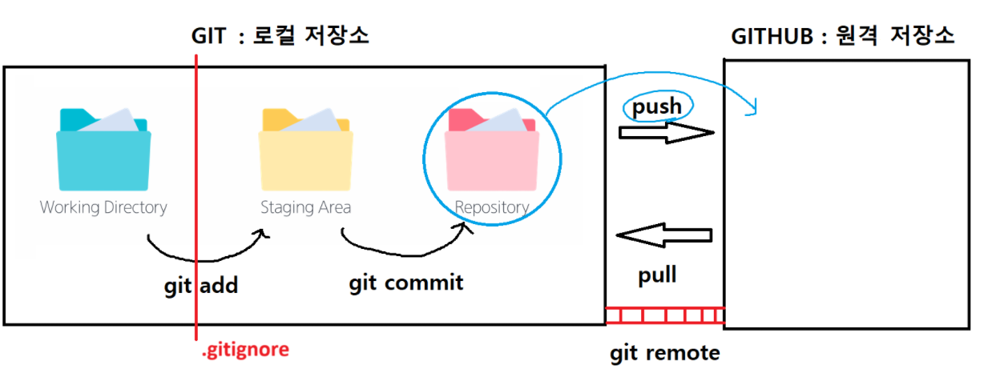

### 깃허브에 커밋 푸시 하는 법

1. 깃허브 로그인
2. 레퍼지토리 생성
3. 깃 배시 → `git remote add origin + 깃허브 주소`
    
    (`shift + Insert` : 붙여넣기)
    
4. `git remote -v` : remote 확인
5. `git push origin +master` : 마스터 브랜치 생성한 후 푸시
    1. origin은 별칭, +: 강제로 진행 , master: 브랜치 명(디폴트)
6. `git pull origin +master` : 수정된 파일을 로컬에 복사
7. `git clone + 깃허브주소` : 깃허브에 저장된 파일 로컬에 그대로 복사
8. `git checkout -b 브랜치이름` : 브랜치를 새로 만들고 동시에 해당 브랜치로 이동

---

### 자리 옮겼을 때 세팅

제어판 -> 사용자계정 -> 윈도우 자격 증명 -> 깃허브, 깃랩 삭제

---

### `gitignore` 란?
Git이 버전 관리하지 말아야 할 파일들을 정의해 놓은 텍스트 파일
용량이 너무 크거나, 보안상 문제가 있거나, 

---

### `git revert` : 특정 커밋을 없었던 일로 만들기
1. `git log` 로 해시값 확인
2. `git revert 해시값` (복사:  ctrl+shift+c / 붙여넣기 shift+Insert)
3. vim 에디터 → esc → :wq

---

### `git reset` : 커밋 되돌리기
1. `git reflog` 입력
2. `git reset —hard HEAD@{1}` : 삭제하고 싶은 HEAD 넘버 입력

---

### staging area 단계에서 `git add .` 취소하기
1.  `commit` 이 없는 경우
- git rm —cached 파일명
    
1. 이전에 했던 `commit` 이 있는 경우(권장)
- git restore —staged 파일명

