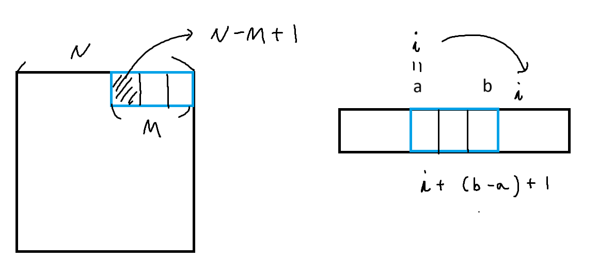

### 문자열 정리
``` python
# 1. 아스키코드
# 대문자 A : 65, 소문자 a : 97
# 대문자 + 32 = 소문자

# 2. find 메서드
# (1) str.find() : 찾으면 발견된 인덱스 반환, 못찾으면 -1 반환
# (2) str.find('a', n)
# : n번 인덱스 부터 시작해서 문자 'a'를 찾아라
# ex) [123]345[87] ---> 87을 parsing하고싶다.
'''
text = "banana"
print(text.find('a')) # 1
print(text.find('a', 2)) # 3
print(text.find('a', 4)) # 5
'''

# 3. 회문 : 거꾸로 읽어도 같은 문자열
# 거꾸로 뒤집는 방법 [::-1]
'''
text = 'level'
def is_p(text):
    return text == text[::-1] # 맞으면 1, 다르면 0 반환

print(int(is_p(text)))
'''
```

### Parsing 시작 2
``` python
arr = ['ABCQ', 'B[4]R', 'CCDA', 'BT[15]']

def get_find(text):
    # 못찾으면 빈문자열 return
    if text.find('[') == -1: return ""
    start = text.find('[') + 1
    end = text.find(']')
    # 찾으면 슬라이싱 return
    return text[start:end]

for text in arr:
    result = get_find(text)
    # 문자열이 비어있으면 False
    # 문자열이 있으면 True
    if result: print(result, end = ' ')
```

### Parsing 시작 3
``` python
text = 'B[45]AB[9994]'

a = text.find('[')
b = text.find(']', a + 1)
c = text.find('[', b + 1)
d = text.find(']', c + 1)

t1 = text[a+1:b]
t2 = text[c+1:d]

print(int(t1) + int(t2))
```

### Parsing 시작 4
``` python
text = 'ABCDEFABCKKKKKABC'

a = 0
b = 0
cnt = 0

while True:
    b = text.find('ABC', a)
    # 더 이상 찾을 수 없을 때까지 반복
    if b == -1: break
    cnt += 1
    a = b + 1

print(cnt)
```

### Parsing final
``` python
arr = ['GOLDABCGOLD', 'HELLOWORLD', 'WHITEGOLD']

def get_count(word):
    cnt = 0
    for text in arr:
        a = 0
        while True:
            b = text.find(word, a)
            if b == -1: break
            cnt += 1
            a = b + 1
    return cnt

print(get_count('GOLD'))
```

### boss 문제 - 회문(palindrome)
``` python
def is_p(text):
    return text == text[::-1]

def find_p():
    # 가로 회문 찾기(행순회)
    for y in range(N):
        for x in range(N-M+1):
            word = ""
            for k in range(M): # k를 M만큼(단어의 길이만큼)
                word += arr[y][x+k]
            if is_p(word): # 만약 회문이면
                return word # 1번 가로 회문

    # 세로 회문 찾기(열순회)
    for x in range(N):
        for y in range(N-M+1):
            word = ""
            for k in range(M):
                word += arr[y+k][x]
            if is_p(word):
                return word # 2번 세로 회문

    return "" # 3번 회문을 찾지 못한 경우

T = int(input())
for tc in range(1, T + 1):
    N, M = map(int, input().split())
    arr = [input() for _ in range(N)]
    result = find_p() # 원본을 바꾸려거나, 디버깅에 필요하면 매개변수로 넣기
    print(f'#{tc} {result}')
```


### boss 문제 - 괄호 친구들

``` python
text = input()
n = len(text)
a, b = 0, 0
cal_v = 0
i = 0 # 초기식
while i < n: # 조건식
    # 덧셈 계산
    if text[i] == '[':
        a = i
        b = text.find(']', a + 1) # 열리는 위치 이후로
        cal_v += int(text[a+1:b])
        i += (b - a) # +1 은 증감식에서
    # 곱셈 계산
    elif text[i] == '{':
        a = i
        b = text.find('}', a + 1) # 열리는 위치 이후로
        cal_v *= int(text[a+1:b])
        i += (b - a)# +1은 증감식에서

    i += 1 # 증감식

print(cal_v)
```