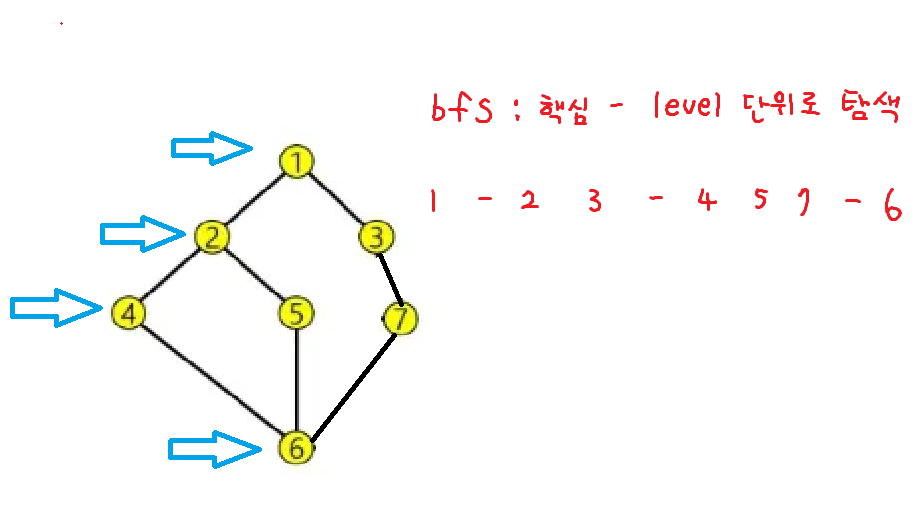
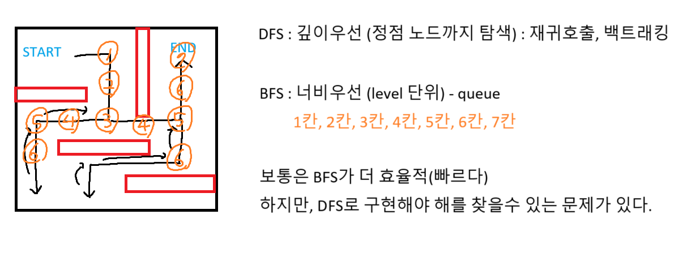

## DFS


## BFS


### DFS와 비교


## heapq
``` python
# 1. 최소힙 2. 최대힙 3. 다중조건힙

# 최소힙
import heapq

pq = []

heapq.heappush(pq, 3)
heapq.heappush(pq, 1)
heapq.heappush(pq, 4)

while pq:
    print(heapq.heappop(pq)) # 1 3 4
```
``` python
# 최대힙
import heapq

pq = []

heapq.heappush(pq, -3)
heapq.heappush(pq, -1)
heapq.heappush(pq, -4)

# 뺄 때는 다시 -를 붙여서 양수로 전환
while pq:
    print(-heapq.heappop(pq)) # 4 3 1
```

``` python
# 다중조건 힙 -> 튜플로
import heapq

pq = []

heapq.heappush(pq, (2, 'A')) # 우선순위 1. 정수 2. 문자열
heapq.heappush(pq, (2, 'B'))
heapq.heappush(pq, (4, 'C'))

while pq:
    print(heapq.heappop(pq)) # (2, 'A') (2, 'B') (4, 'C')
```

### 우선순위큐 준비1, 준비2
``` python
import heapq

arr = [5, 2, 8, 1, 9]

pq = []

# 힙에 넣을 때 음수로 변환
for x in arr:
    heapq.heappush(pq, -x)

# 꺼낼 때 다시 양수로 변환
sorted_arr = []
while pq:
    sorted_arr.append(-heapq.heappop(pq))

print(sorted_arr)
```

### 우선순위 큐 시작 1
``` python
# 1순위 짝수, 2순위 작은수
import heapq

numbers = [5, 2, 8, 1, 9, 4]
pq = []
for x in numbers:
    is_odd = x % 2 # 짝수면 0, 홀수면 1
    heapq.heappush(pq, (is_odd, x))

while pq:
    priority, num = heapq.heappop(pq)
    print(num, end = ' ')

```

### 우선순위 큐 시작 2
``` python
import heapq
pq = []

data = [(7, 'A'), (9, 'C'), (7, 'C'), (6, 'D'), (5, 'A')]

for num, char in data:
    heapq.heappush(pq, (char, -num)) # 문자우선, -num으로 최대힙

while pq:
    char, neg_num = heapq.heappop(pq)
    print(f'({-neg_num}, {char})', end = ' ')

```

### 우선순위 큐 응용
``` python
import heapq

n = int(input())
data = [(9, 'A'), (8, 'B'), (9, 'A'), (10, 'C'), (15, 'A')]
pq = []

# (숫자, -ord(문자)) # 숫자 최소힙, 문자 최대힙
# 최대힙이 push하기 전에 - 붙여서
for num, char in data:
    heapq.heappush(pq, (num, -ord(char)))

# n번반복
for _ in range(n):
    # 1. 가장 작은수 제거
    num, neg_ascii = heapq.heappop(pq)
    # 2. 계산 후 다시 삽입
    new_num = (num * 2) % 17
    heapq.heappush(pq, (new_num, neg_ascii))

while pq:
    num, neg_ascii = heapq.heappop(pq)
    # pop한 후에 -를 붙임
    print(f'({num}, {chr(-neg_ascii)})', end = ' ')

```

### 우선순위 큐 final
``` python
import heapq

data = [(2, 'BHC'), (1, 'NeNe'), (3, 'KFC'), (1, 'BBQ'), (2, 'Moms'), (4, 'MC')]
pq = []

# 크기 순으로 정렬되도록
for size, name in data:
    heapq.heappush(pq, (size, name))

# 한마리 남을때 까지 병함
while len(pq) > 1:
    # 가장 작은 미생물 두마리 꺼내기(최소힙)
    size1, name1 = heapq.heappop(pq)
    size2, name2 = heapq.heappop(pq)
    # 새로운 미생물생성
    new_size = size1 + size2
    # 사전순으로 앞에 있는 이름 선택
    new_name = min(name1, name2)
    # 새로 생성된 미생물 힙에 push
    heapq.heappush(pq, (new_size, new_name))
    
# 마지막 남은 미생물
final_size, final_name = heapq.heappop(pq)
print(final_name, final_size)

```

### 정중앙 대학교
일반 버전
``` python
n = int(input())
scores = [500] # 초기값 500

for _ in range(n): # N
    a, b = map(int, input().split())
    scores.append(a)
    scores.append(b)
    scores.sort() # NlogN

    length = len(scores)
    mid = scores[length // 2]

    print(mid)

# 시간복잡도 O(N제곱 logN)
```

heapq 버전
``` python
import heapq

max_heap = [] # 내림차순 중간값 보다 작은값 (최대힙)
min_heap = [] # 오름차순 중간값 보다 큰값 (최소힙)
mid = 500

def push(v):
    if mid > v: # 중간값 보다 작으면 최대 힙에 추가
        heapq.heappush(max_heap, -v)
    else: # 중간값보다 크거나 같으면 최소 힙에 추가
        heapq.heappush(min_heap, v)

n = int(input())

for _ in range(n):
    a, b = map(int, input().split())
    push(a)
    push(b)

    # 경우가 두가지 1. 왼쪽이 더 많을 경우 (최대힙의 크기가 더 클경우)
    # 2. 오른쪽이 더 많을 경우 (최소힙의 크기가 더 클경우)

    if len(max_heap) > len(min_heap):
        # 최대힙이 많으니까 최소힙에 넣기 (갯수맞추기)
        heapq.heappush(min_heap, mid)
        # 최대 힙에서 가장 큰값 꺼내서 새로운 중간값으로 설정
        mid = -heapq.heappop(max_heap)
    elif len(max_heap) < len(min_heap):
        heapq.heappush(max_heap, -mid)
        mid = heapq.heappop(min_heap)

    print(mid)

# 시간복잡도가 NlogN

```

