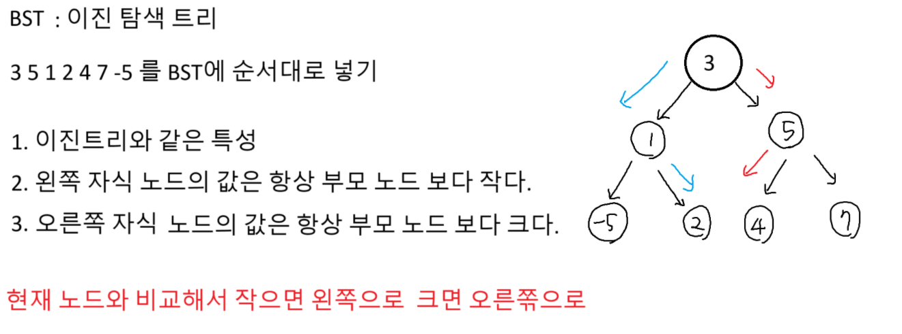
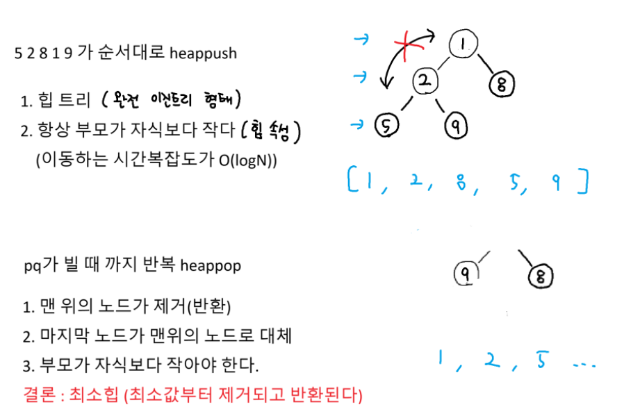
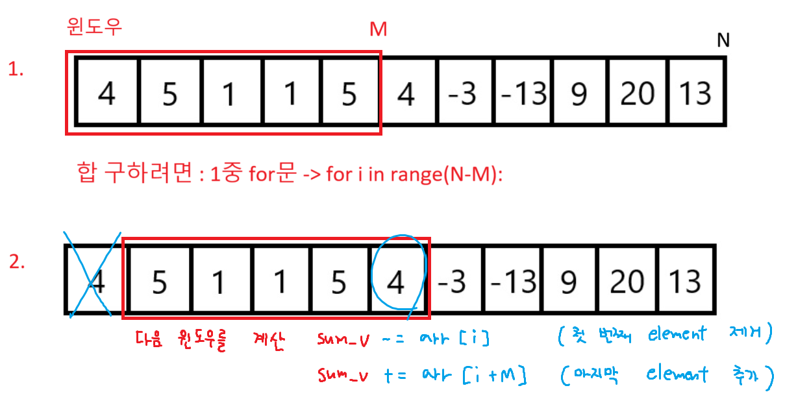
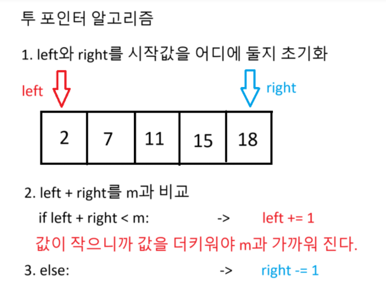
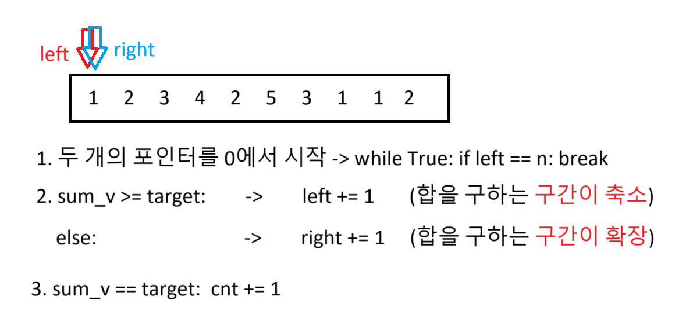
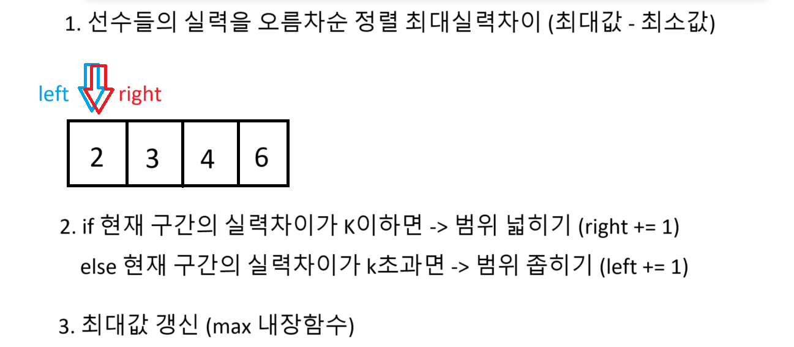

## 이진탐색 트리 (복습)




## A형 역량테스트(SW)

기출에서 한 문제는 나온다

### 슬라이딩 윈도우 준비1

```python
arr = [4, 5, 1, 1, 5, 4, -3, -13, 9, 20, 13]

idx = int(input())

def get_sum(idx):
    sum_v = 0
    # 5개의 합
    for i in range(5):
        sum_v += arr[idx + i]# +0, +1, +2, +3, +4 인덱싱

    return sum_v

print(get_sum(idx))
```

### 슬라이딩 윈도우 준비2

```python
arr = [4, 5, 1, 1, 5, 4, -3, -13, 9, 20, 13]

def get_sum(idx):
    sum_v = 0
    # 5개의 합
    for i in range(5):
        sum_v += arr[idx + i]# +0, +1, +2, +3, +4 인덱싱

    return sum_v

N = len(arr)
M = 5

max_v = float('-inf')
for idx in range(N-M+1):
    ret = get_sum(idx)
    if ret > max_v: # 최대값 갱신
        max_v = ret
        max_idx = idx # 최대값 일때 인덱스

print(max_idx)

```

### 슬라이딩 윈도우 시작1



```python
arr = [4, 5, 1, 1, 5, 4, -3, -13, 9, 20, 13]

# 처음 윈도우 계산
sum_v = sum(arr[:5]) # 슬라이싱
max_v = sum_v
max_idx = 0

# N-M
for i in range(len(arr)-5):
    # 1. 다음 윈도우 계산 (현재 i를 기준으로 다음 윈도우를 계산)
    sum_v -= arr[i] # 첫번째 element 제거
    sum_v += arr[i + 5] # 마지막 element 추가

    # 2. 최대값 갱신
    if sum_v > max_v:
        max_v = sum_v # 다음 윈도우의 합
        # 현재 윈도우의 index는 : i, 다음 윈도우의 index : i + 1
        max_idx = i + 1

print(max_idx)
```

### 슬라이딩 윈도우 시작2

```python
n, m = map(int, input().split())
arr = list(map(int, input().split()))

sum_v = sum(arr[:m]) # 첫 번째 윈도우의 합
max_v = sum_v
max_idx = 0

# 슬라이딩 윈도우 기법
for i in range(n-m):
    # 1. 다음 윈도우 계산
    sum_v -= arr[i] # 첫 번째 값 빼고
    sum_v += arr[i+m] # 마지막 값 더하고

    # 2. 최대값 갱신
    if sum_v > max_v:
        max_v = sum_v
        max_idx = i + 1 # i가 현재 윈도우니까 i + 1이 다음 윈도우

print(max_idx)
```

## 투포인터 알고리즘



### 투포인터 시작1

```python
def get_idx():
    left = 0 # 왼쪽 포인터 (배열의 시작)
    right = len(arr) - 1 # 오른쪽 포인터 (배열의 끝)

    while left < right: # 두 포인터가 만나기 전까지 반복
        current_sum = arr[left] + arr[right] # 현재 합계

        if current_sum == m: # 현재 합이 타겟과 일치
            print(left, right)
            return

        elif current_sum < m: # 현재 합이 타겟보다 작으면
            left += 1 # 왼쪽 포인터를 오른쪽으로 이동(합을 키우기 위해)

        else:
            right -= 1 # 오른쪽 포인터를 왼쪽으로 이동 (합을 줄이기 위해)

    print('찾을 수 없음')

n, m = map(int, input().split())
arr = list(map(int, input().split()))
get_idx()
```

### 투포인터 시작2



```python
n, target = map(int, input().split())
arr = list(map(int, input().split()))
cnt, sum_v = 0, 0
right, left = 0, 0 # left right 모두 0에서 시작

while True:
    # 합이 타겟 이상이거나 right가 끝에 도달했을때 -> 범위 좁히기
    if sum_v >= target or right == n:
        sum_v -= arr[left] # left 값을 빼고
        left += 1 # left를 오른쪽으로 이동 (범위 좁히기)

    elif sum_v < target:
        sum_v += arr[right] # right 값을 더하고
        right += 1 # right를 오른쪽으로 이동 (범위 넓히기)

    if sum_v == target: cnt += 1

    # 왼쪽 포인터가 n에 도달하면 break
    if left == n: break

print(cnt)
```

### im 기출 대비 야구선수



```python
T = int(input())
for tc in range(1, T + 1):
    n, k = map(int, input().split())
    players = list(map(int, input().split()))
    players.sort() # 오름차순 정렬

    left, right = 0, 0
    ret = 0

    while left < n and right < n:
        # 실력차이가 K 초과
        if players[right] - players[left] > k:
            left += 1 # 범위 좁히기
        else: # 실력차이가 K 이하
            right += 1 # 범위 넓히기

        # right-left+1
        # right가 +1 되고 크기를 계산
        # right-left
        ret = max(right-left, ret)
    print(f'#{tc} {ret}')

```
