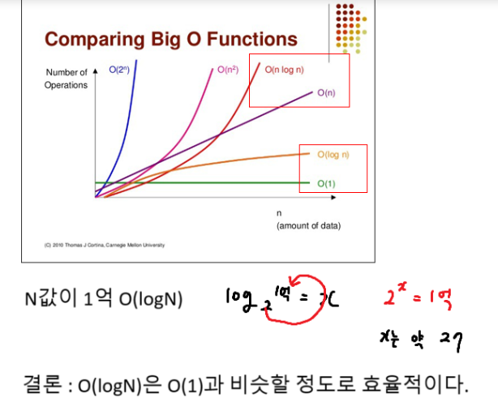

## 시간복잡도





## 인접행렬


### DFS 준비 1

```python
name = 'BTAR'
MAP = [
    [0, 0, 0, 0],
    [1, 0, 0, 0],
    [1, 1, 0, 0],
    [1, 1, 0, 0]
]

n = int(input())
for i in range(4):
    # 단점 : 들여쓰기가 생긴다
    # if MAP[n][i] == 1:
    #     print(name[i])
    if MAP[n][i] == 0: continue
    print(name[i])
```


### DFS 준비 2

```python
# 인접 행렬
MAP = [
    [0, 1, 0, 0, 0],
    [0, 0, 1, 1, 0],
    [0, 1, 0, 0, 0],
    [0, 0, 0, 0, 0],
    [0, 1, 0, 0, 0]
]
num = int(input()) # 노드 값
n = num - 1 # 노드 번호
for i in range(5):
    if MAP[n][i] == 0: continue
    print(i + 1) # 노드 값
```

### DFS 준비 3

```python
m = []

m.append([])
m.append([])
m[0].append(3)
m[0].append(5)

print(m)
```

### DFS 준비 4

```python
m = [[] for _ in range(4)] # 4행 2차원 배열
m[0] = [4, 2, 5, 1, 1]
m[1] = [3, 4, 2]
m[3] = [1, 1, 2, 3]

for i in m:
    print(i)
```
