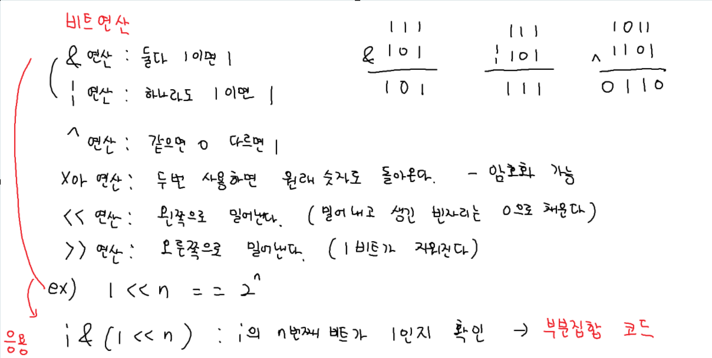
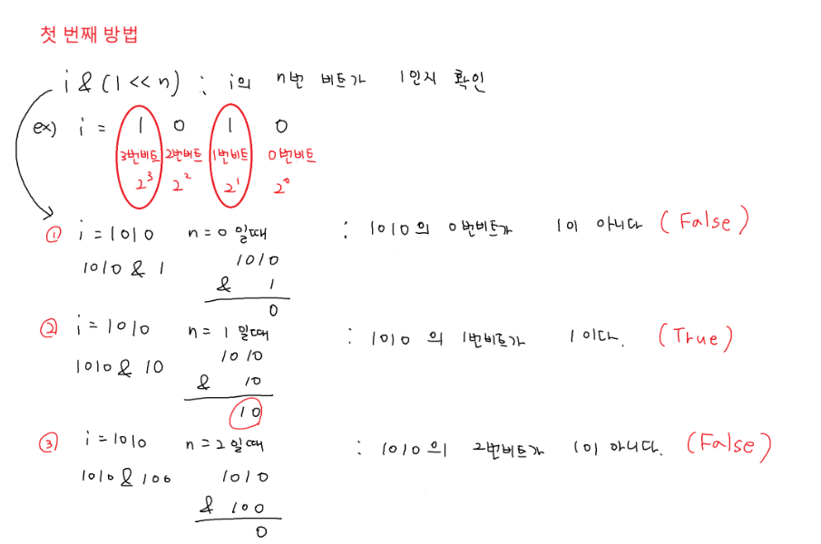
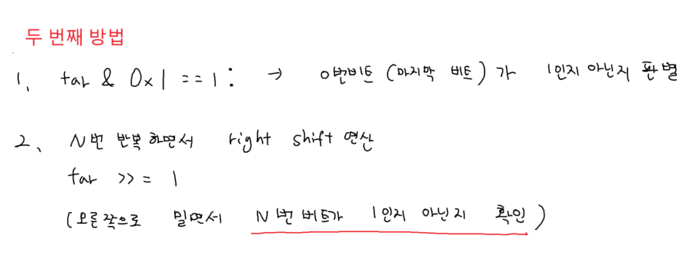
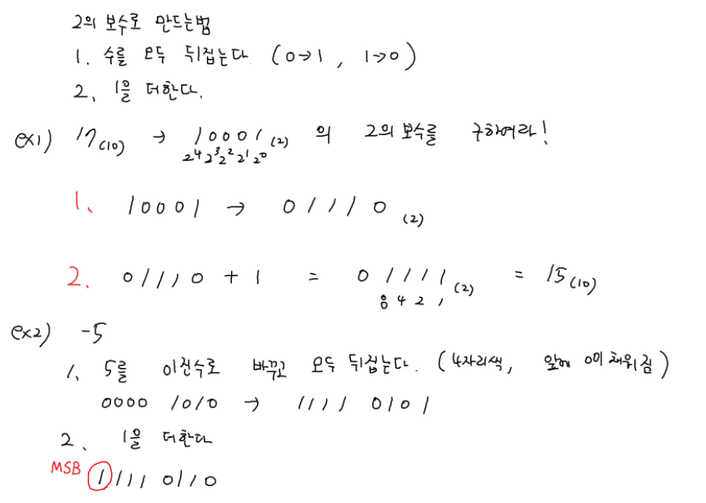

## 비트연산





### 이진수 표현

```python
arr = [1, 2, 3, 4, 5]

for i in arr:

    if i == 3:
        break

    print(i) # 1 2

for i in arr:

    if i == 3:
        continue

    print(i) # 1 2 4 5

# 첫 번째 방법

T = int(input())

for tc in range(1, T + 1):

    N, M = map(int, input().split())

    TOGGLE = "ON"
    for i in range(N):
        if M & (1 << i):
            continue

        TOGGLE = "off"
        break

    print(f'#{tc} {TOGGLE}')

# 두 번째 방법

def solve():
    tar = M
    for i in range(N):
        if tar & 0x1 == 0:
            return 'OFF'
    tar >>= 1 # N번 반복하면서 오른쪽으로 한번씩 민다. M의 1비트가 1인지 확인

    return 'ON'

T = int(input())
for tc in range(1, T + 1):
N, M = map(int, input().split())
print(f'#{tc} {solve()}')
```

### 이진수 2

```python
def change(n):
    binary = ""
    power = -1 # 2의 -1제곱부터 시작
    cnt = 0

    while n > 0 and cnt < 13:
        value = 2 ** power  # 2의 -1제곱, 2의 -2제곱....

        if n >= value: # 현재 자리값을 뺄 수있다.
            binary += "1" # 이진수 1
            n -= value # 값 빼주고
        else:
            binary += "0" # 자리값을 뺄수 없으면 0

        power -= 1
        cnt += 1

    if n > 0: # 계산이 끝났는데도 n이 남아있으면
        return 'overflow'
    else:
        return binary

T = int(input())
for tc in range(1, T + 1):
    N = float(input())
    result = change(N) # 함수호출
    print(f'#{tc} {result}')
```

### 보수 구하기


