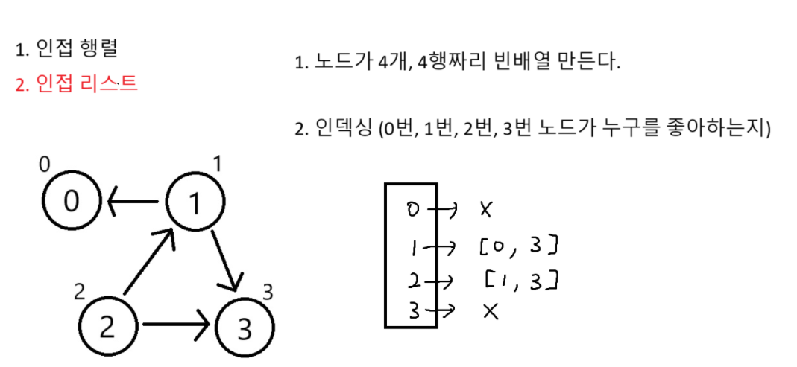
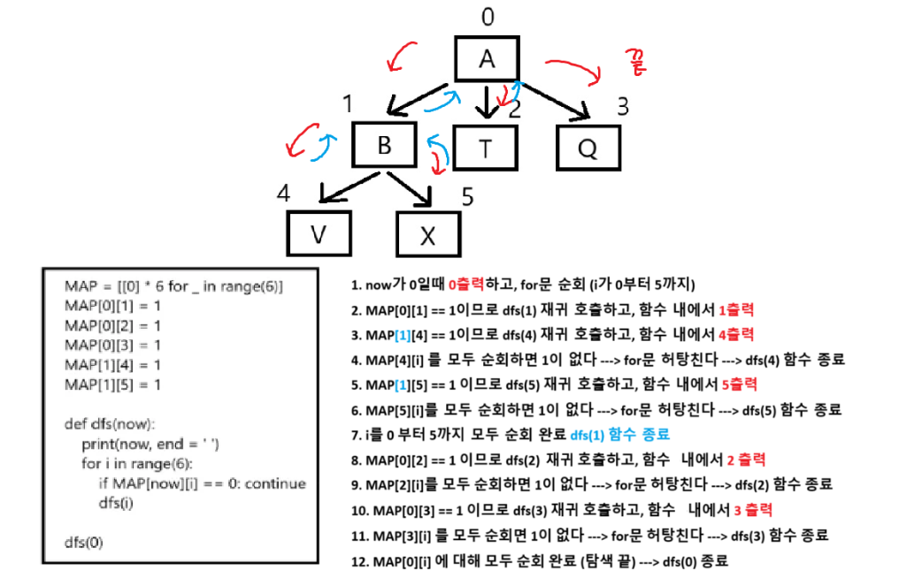
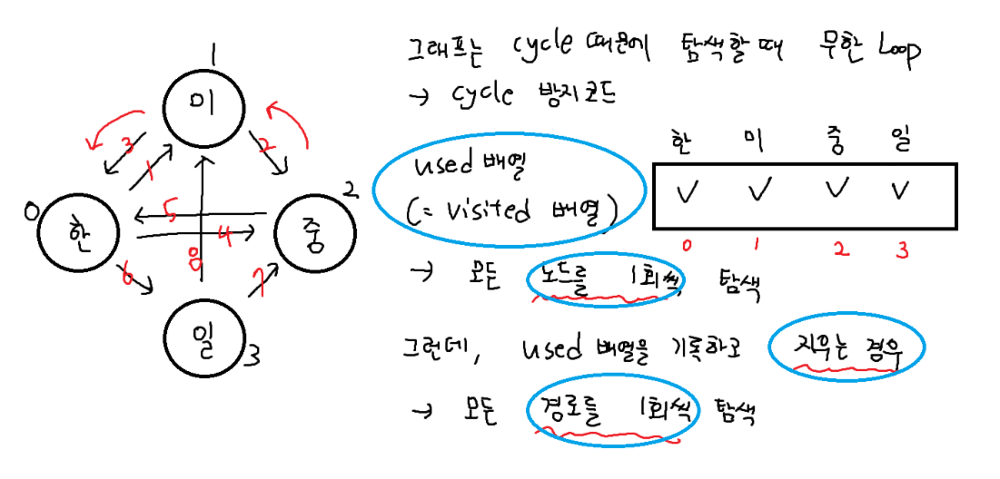
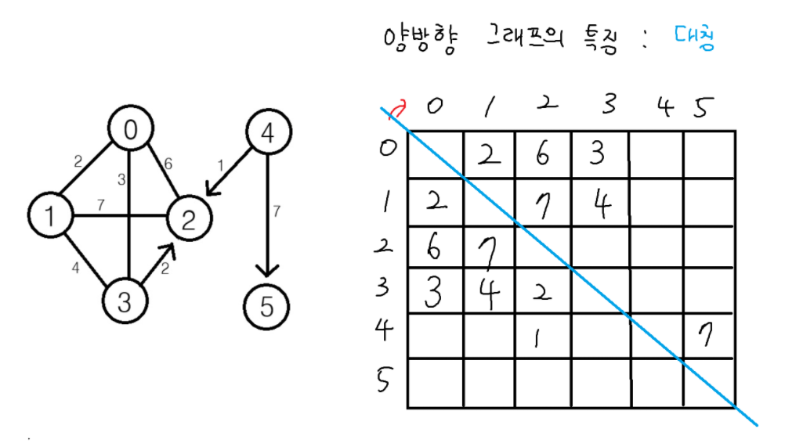

## DFS



### DFS 준비 5

```python
# 3행 2차원 빈배열
m = [[] for _ in range(3)]

m[0] = ['A', 'B', 'T']
m[2] = ['R', 'S']

for y in range(len(m)): # 3번
    # 거꾸로 순회
    for x in range(len(m[y]) - 1, -1, -1): # 3번, 0번, 2번
        print(m[y][x], end = '')
    print() # 줄바꿈
```

### DFS 준비 6

```python
# 인접행렬이 빠를까 인접리스트 빠를가?
# 인접리스트가 빠르다 왜? 비어있기때문에
# (인접행렬을 0으로 채워져 있기 때문에)

alist = [[] for _ in range(4)]

# 인덱싱
alist[1] = [0, 3]
alist[2] = [1, 3]

print(alist)
```

### DFS 시작 1 트리의 DFS



```python
arr = "ABTQVX"
MAP = [[0] * 6 for _ in range(6)]

MAP[0][1] = 1
MAP[0][2] = 1
MAP[0][3] = 1
MAP[1][4] = 1
MAP[1][5] = 1


def DFS(now):
    print(now, end=' ')
    for i in range(6):
        if MAP[now][i] == 0: continue
        DFS(i)

DFS(0)
```

### DFS 시작 2 그래프의 DFS



```python
# 그래프의 dfs 인접행렬
MAP = [[0] * 4 for _ in range(4)]

MAP[0][1] = 1
MAP[0][3] = 1
MAP[1][2] = 1
MAP[2][0] = 1
MAP[2][3] = 1
MAP[3][2] = 1

used = [0] * 4
used[0] = 1 # 시작노드 방문 처리

def dfs(now):
    print(now)
    for i in range(4):
        if MAP[now][i] == 0: continue
        # 이미 갔던 곳(방문했던 곳)이라면 무시
        if used[i] == 1: continue
        # 방문표시
        used[i] = 1
        dfs(i)

dfs(0)

```

```python
# 그래프의 dfs 인접 리스트
m = [[] for _ in range(4)]
m[0] = [1, 3]
m[1] = [2]
m[2] = [0, 3]
m[3] = [2]

used = [0] * 4
used[0] = 1 # 시작노드 방문표시

def dfs(now):
    print(now)
    for i in range(len(m[now])):
        next = m[now][i]
        # used 검사( 한번 갔던 곳은 안가겠다.)
        if used[next] == 1: continue
        # 방문했으면 방문했다고 기록
        used[next] = 1
        dfs(next)

dfs(0)
```

### DFS 시작 3 가중치

```python
n = int(input())
MAP = [
    [0, 7, 20, 8],
    [0, 0, 5, 0],
    [15, 0, 0, 0],
    [0, 0, 6, 0]
]

used = [0] * 4
used[0] = 1 # 시작노드 방문처리

# 모든 경로를 탐색 (used배열을 지워줘야한다)
def dfs(now, sum_v):
    if now == n: # 목적지에 도착하면
        print(sum_v, end = ' ')

    for i in range(4):
        if MAP[now][i] == 0: continue
        if used[i] == 1: continue
        used[i] = 1
        # dfs(i, sum_v + 인접행렬의 좌표)
        dfs(i, sum_v + MAP[now][i])
        used[i] = 0 # 모든 경로 탐색

dfs(0, 0)
```


