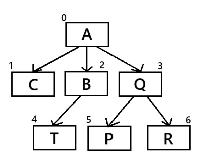
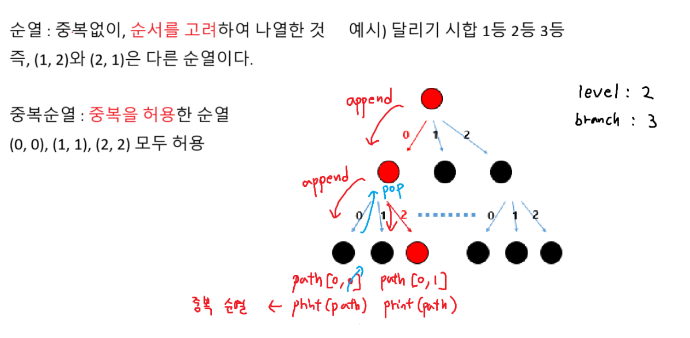
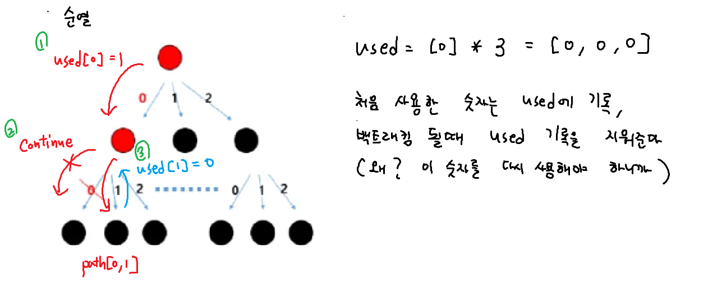
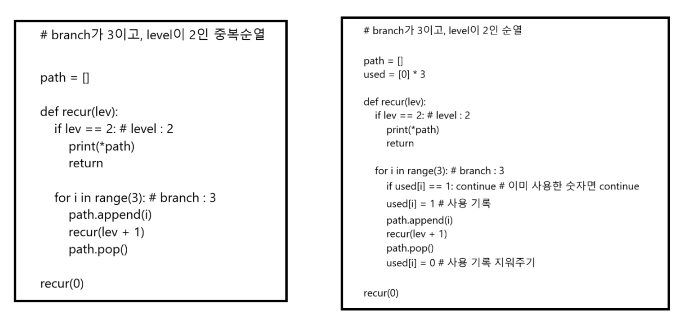
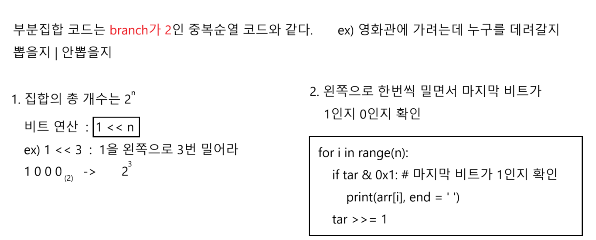
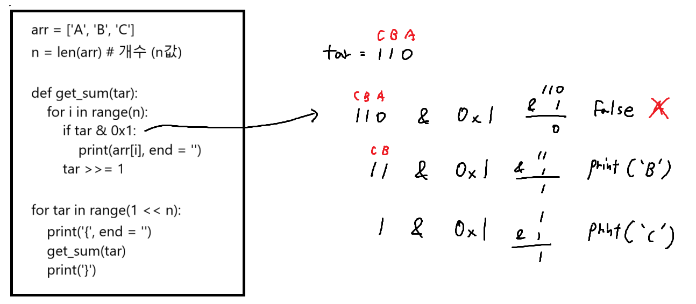

### 인접행렬과 인접리스트의 차이


인접행렬 = 모든 노드 수를 0으로 채우고 가는 곳만 1로 바꿈
인접리스트 = 가는 곳만 '인덱스'로 표시

```python
# 인접 행렬
alist = [
    [0,1,1,1,0,0,0],
    [0,0,0,0,0,0,0],
    [0,0,0,0,1,0,0],
    [0,0,0,0,0,1,1],
    [0,0,0,0,0,0,0],
    [0,0,0,0,0,0,0],
    [0,0,0,0,0,0,0]
]

# 연결안된 노드
alist[start][end] = 0

# 연결된 노드
alist[start][end] = 1
```

```python
# 인접리스트
alist = [
    [1,2,3],
    [],
    [4],
    [5,6],
    [],
    [],
    []
]

# 연결된 노드
for i in range(len(alist[start])):
    alist[start][i]
```

### 순열과 중복순열





### 부분집합




### 조합

5명중에 3명을 뽑는 조합 ( 순서를 고려하지 않는다 )
['A', 'B', 'C']와 ['C', 'B', 'A']는 같은 조합이다.
조합을 for문으로 구현

```python
arr = ['A', 'B', 'C', 'D', 'E']

for a in range(5):
    start1 = a + 1
    # a에서 뽑은건 포함하면 안된다.
    for b in range(start1, 5): # branch가 최대 5
        start2 = b + 1
        # b에서 뽑은건 포함하면 안된다.
        for c in range(start2, 5): # branch가 최대 5
            print(arr[a], arr[b], arr[c])
```

level이 n이고 branch가 최대 5인
조합 재귀호출 코드

```python
arr = ['A', 'B', 'C', 'D', 'E']
path = []
n =  3 # 5명중에 3명을 뽑는다

def recur(lev, start):
    if lev == n: # level은 n(n명 뽑는다)
        print(*path)
        return

    for i in range(start, 5): # branch가 최대 5
        path.append(arr[i])
        recur(lev + 1, i + 1)
        path.pop()

recur(0, 0)
```

1.level : 6 카드 6장을 뽑는다 / branch : 6 6개의 순열을 만든다

중복순열 vs 순열
순열이기때문에 used배열 사용

baby-gin 판별 함수 만들기 return (cnt == 2)
3-1. 앞에 세자리가 triplet 또는 run이라면 cnt += 1
3-2. 뒤에 세자리가 triplet 또는 run 이라면 cnt += 1

### baby-gin

```python
used = [0] * 6
path = []
is_babygin = 0

def is_baby_gin():
    cnt = 0
    # 앞에 세자리가 triplet 또는 run
    a, b, c = path[0], path[1], path[2]
    if a == b == c: cnt += 1
    elif (a) == (b - 1) == (c - 2) : cnt += 1

    # 뒤에 세자리가 triplet 또는 run
    a, b, c = path[3], path[4], path[5]
    if a == b == c: cnt += 1
    elif (a) == (b - 1) == (c - 2) : cnt += 1

    return cnt == 2 # cnt 가 2면 baby-gin이 맞다!

# 순열 코드
def recur(lev):
    global is_babygin
    if lev == 6: # level은 6
        if is_baby_gin():
            is_babygin = 1
        return

    for i in range(6): # branch는 6
        if used[i] == 1: continue
        used[i] = 1
        path.append(arr[i])
        recur(lev + 1)
        path.pop()
        used[i] = 0

arr = list(map(int, input().split()))
recur(0)

if is_babygin: print('Yes')
else: print('No')

```

### 최소합

```python
dfs로 풀건데 그러면 dfs재귀호출을 언제할거냐??
좌표를 이동할때 dfs호출

1-1. 오른쪽으로 이동 할때 dfs호출 dfs(y, x, sum_v)
1-2. 아래로 이동 할때 dfs 호출 dfs(y, x, sum_v)

2. 정점 노드에 도달하면 return (좌표 끝 - 우측 하단)
    if y == N - 1 and x == N - 1:
    최소값 갱신(min_sum)
        return

3. 가지치기 (sum_v를 재귀호출 할때마다 갱신)
    sum_v >= min_sum -> 가지치기
```

```python
def dfs(y, x, sum_v):
    global min_sum

    # 좌표 끝에 도달 했을때(정점 노드에 도달 했을때)
    if y == N - 1 and x == N - 1:
        # 최소값 갱신하고 return
        min_sum = min(min_sum, sum_v)
        return

    # 가지치기
    if sum_v >= min_sum:
        return

    # 오른쪽으로 이동
    if x < N - 1:
        dfs(y, x + 1, sum_v + arr[y][x + 1])

    # 아래로 이동
    if y < N - 1:
        dfs(y + 1, x, sum_v + arr[y + 1][x])

T = int(input())
for tc in range(1, T + 1):
    N = int(input())
    arr = [list(map(int, input().split())) for _ in range(N)]
    min_sum = float('inf')
    dfs(0, 0, arr[0][0])
    print(f'#{tc} {min_sum}')
```

### 전자카드

```python
1. branch, level : N-1

2. 음수인덱스
마지막 구역에서 사무실로 돌아오는 비용
arr[path[-1]][0]

3. 마지막 방문 지점의 이전에 방문한 지점
arr[path[-2]][i]
```

```python
def dfs(lev, sum_v):
    global min_v

    if lev == N - 1: # lev은 N-1
        # 마지막 구역에서 사무실로 돌아오는 비용
        sum_v += arr[path[-1]][0] #
        min_v = min(min_v, sum_v) # 최소값 갱신
        return

    for i in range(1, N): # branch N-1
        if used[i] == 1: continue
        used[i] = 1
        path.append(i)
        dfs(lev + 1, sum_v + arr[path[-2]][i])
        path.pop()
        used[i] = 0

T = int(input())
for tc in range(1, T + 1):
    N = int(input())
    arr = [list(map(int, input().split())) for _ in range(N)]
    path = [0] # 사무실 (0)에서 시작
    used = [0] * N
    used[0] = 1 # 사무실 방문처리
    min_v = float('inf')
    dfs(0, 0)
    print(f'#{tc} {min_v}')
```
