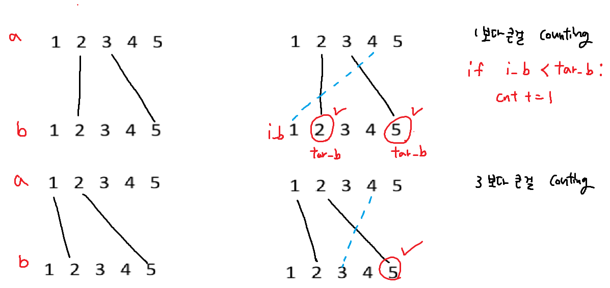
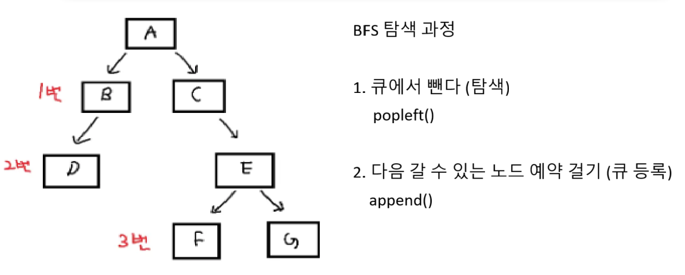
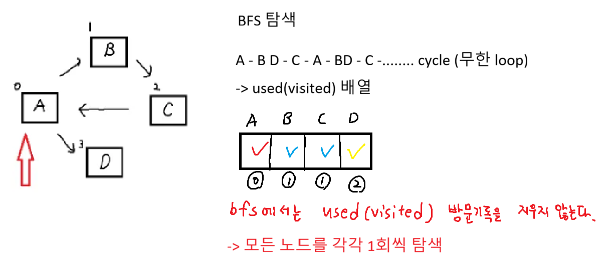

### 증가하는 사탕수열 전략

```python
3가지 경우 -> 함수로 만들어서 return 처리

1. 이미 만족하는 경우 return 0

2. 사탕을 먹고 조건에 만족하면 return eat_A + eat_B

3. 조건에 만족하지 않으면 return -1
```

### 증가하는 사탕수열 정답코드

```python
def get_eating(A, B, C):
    # 1. 이미 만족 하는 경우
    if A < B < C:
        return 0

    # 사탕 개수 계산
    # 예를들어 B=5, C=5 5 - (5 - 1) | B - (C - 1), 1개먹어야한다
    # B=6, C=5인 경우 6 - (5 - 1) | B - (C - 1), 2개먹어야한다

    eat_B = max(0, B - C + 1)
    new_B = B - eat_B

    eat_A = max(0, A - new_B + 1)
    new_A = A - eat_A

    # 2. 조건을 만족하는지 확인 if - else
    if 0 < new_A < new_B < C:
        return eat_A + eat_B
    else: # 3. 조건을 만족하지 않는 경우
        return -1

T = int(input())
for tc in range(1, T + 1):
    A, B, C = map(int, input().split())
    result = get_eating(A, B, C)
    print(f'#{tc} {result}')
```



### 전봇대

```python
def get_result():
    size = len(arr)
    cnt = 0

    for i in range(size): # 기준이 되는 전봇대
        for tar in range(i): # 갯수를 세야하는 전봇대
            # a 첫번째 전봇대, b 두번째 전봇대
            i_a, i_b = arr[i][0], arr[i][1]
            tar_a, tar_b = arr[tar][0], arr[tar][1]

            if i_b < tar_b: cnt += 1

    return cnt


T = int(input())
for tc in range(1, T + 1):
    N = int(input())
    arr=[]
    for n in range(N):
        a, b = map(int, input().split()) # 전봇대
        arr.append((a, b))

    arr.sort(key=lambda x : x[0]) # 첫 번째 원소(a전봇대)를 기준으로 정렬
    result = get_result()
    print(f'#{tc} {result}')

```



## BFS

### BFS 검색 과정

```python
from collections import deque

alist = [[] for _ in range(7)]

alist[0] = [1, 2]
alist[1] = [3]
alist[2] = [4]
alist[4] = [5, 6]

q = deque()
q.append(0) # start지점

name = "ABCDEFG"

while q: # 큐가 빌때 까지 반복
    # 1. 큐에서 뺀다(탐색) - popleft()
    now = q[0]
    q.popleft()
    print(name[now], end = ' ')

    # 2. 다음 갈곳 예약 걸기(큐 등록) - append()
    for i in range(len(alist[now])):
        next = alist[now][i]
        q.append(next)

```



### BFS 시작 1

```python
from collections import deque

def bfs(start):
    q = deque()
    used = [0] * 6
    # 큐에 start 노드 넣고, 시작노드 방문처리
    q.append(start)
    used[start] = 1

    while q:
        # 1. 큐에서 뺀다 (탐색)
        now = q[0]
        print(chr(now + ord('A')), end = ' ')
        q.popleft()
        # 2. 다음 갈곳 예약 걸기(큐 등록)
        for i in range(len(alist[now])):
            next = alist[now][i]
            # 이미 탐색했으면 continue
            if used[next] == 1: continue
            # 방문 표시
            used[next] = 1
            q.append(next) # 예약 걸기
            # 방문기록 지우지 X


alist = [[] for _ in range(6)]
alist[0] = [1, 2]
alist[1] = [0, 2]
alist[2] = [0, 1, 3]
alist[3] = [2, 4]
alist[4] = [3]
n = int(input())
bfs(n)
```

### BFS final

```python
from collections import deque

MAP = [
    [0, 1, 0, 0, 1],
    [0, 0, 0, 1, 1],
    [1, 0, 0, 0, 0],
    [1, 0, 1, 0, 0],
    [0, 0, 0, 0, 0]
]

q = deque()
used = [0] * 5
start, end = map(int, input().split())
# start 노드 q에 넣어주고,
# level도 같이 넣어준다. q.append((node, level))
q.append((start, 0))
used[start] = 1 # 시작노드 방문처리

while q:
    # 1. 큐에서 뺀다(탐색)
    now, level = q[0]
    q.popleft()

    # now가 end에 도착했을때 break
    if now == end:
        print(level) # 비행기를 몇번 탔는지
        break

    # 2. 다음 갈곳 예약 걸기(큐에 등록)
    for i in range(5):
        if MAP[now][i] == 0: continue
        if used[i] == 1: continue
        used[i] = 1
        q.append((i, level + 1)) # 큐 등록
```

### 플러드필

```python
# 플러드필
# bfs + 좌표(방향배열)
from collections import deque

# 5x5 행렬
visited = [[0] * 5 for _ in range(5)]

# 방향 배열
dy = [-1, 1, 0, 0]
dx = [0, 0, -1, 1]

def flood_fill(start_y, start_x):
    q = deque()
    q.append((start_y, start_x)) # 시작 좌표를 큐에 추가
    visited[start_y][start_x] = 1 # 시작 좌표를 방문 처리

    while q:
        # 1. 큐에서 뺀다(탐색)
        now_y, now_x = q.popleft()
        # 2. 다음 갈곳 예약 걸기
        for i in range(4): # 4방향
            ny = now_y + dy[i]
            nx = now_x + dx[i]

            # 방향배열 범위체크 (좌표 범위체크)
            if ny < 0 or nx < 0 or ny >= 5 or nx >= 5: continue

            # 이미 방문했으면 continue
            if visited[ny][nx] != 0: continue

            # 큐 등록 + 거리 업데이트
            visited[ny][nx] = visited[now_y][now_x] + 1
            q.append((ny, nx))


# 함수 호출
sty, stx = map(int, input().split())
flood_fill(sty, stx)

# 결과 출력
for y in range(5):
    for x in range(5):
        print(visited[y][x], end = " ")
    print()
```
