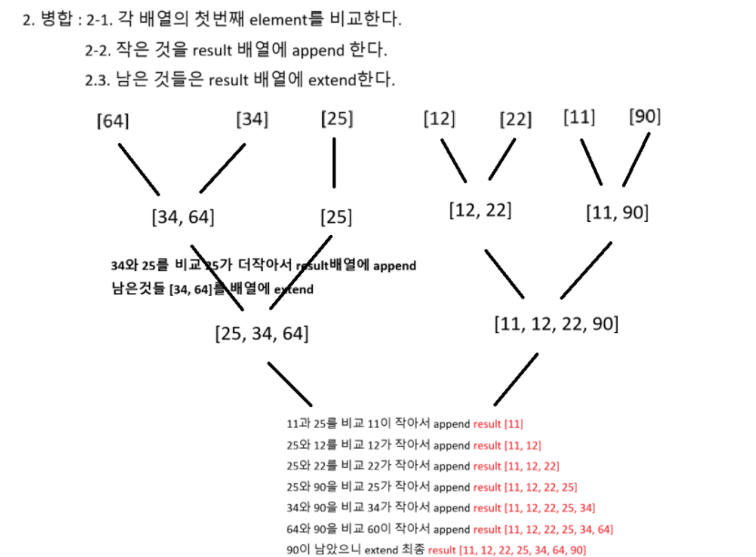

### 탈주범 검거

```python
# 자료구조!
# pipe의 모든 경우 [상, 하, 좌, 우] -> 8개의 종류
pipe = [[0, 0, 0, 0], [1, 1, 1, 1], [1, 1, 0, 0], [0, 0, 1, 1], [1, 0, 0, 1 ], [0, 1, 0, 1], [0, 1, 1, 0], [1, 0, 1, 0]]
# 델타배열(방향배열) : 상 하 좌 우
dy, dx = [-1, 1, 0, 0], [0, 0, -1, 1]
# 다음칸으로 연결되는 파이프의 방향은 반대방향이어야 한다
# 상, 하, 좌, 우 : 0, 1, 2, 3
# 상 -> 하, 하 -> 상, 좌 -> 우, 우 -> 좌
opp = [1, 0, 3, 2]
```

```python
from collections import deque

# 자료구조!
# pipe의 모든 경우 [상, 하, 좌, 우] -> 8개의 종류
pipe = [[0, 0, 0, 0], [1, 1, 1, 1], [1, 1, 0, 0], [0, 0, 1, 1], [1, 0, 0, 1 ], [0, 1, 0, 1], [0, 1, 1, 0], [1, 0, 1, 0]]
# 델타배열(방향배열) : 상 하 좌 우
dy, dx = [-1, 1, 0, 0], [0, 0, -1, 1]
# 다음칸으로 연결되는 파이프의 방향은 반대방향이어야 한다
# 상, 하, 좌, 우 : 0, 1, 2, 3
# 상 -> 하, 하 -> 상, 좌 -> 우, 우 -> 좌
opp = [1, 0, 3, 2]

def bfs():
    q = deque()
    visited = [[0] * M for _ in range(N)] # NxM행렬
    q.append((R, C)) # 시작 위치 큐에 추가
    visited[R][C] = 1 # 시작 노드 방문 표시
    cnt = 1

    while q:
        # 1. 큐에서 뺀다(탐색)
        y, x = q.popleft()

        # 언제 cnt 반환할까?
        # 시간이 L에 도달하면 cnt 반환
        if visited[y][x] == L:
            return cnt

        # 4방향
        for i in range(4):
            ny, nx = y + dy[i], x + dx[i]
            # 좌표범위안에, 방문하지 않아야하고, 파이프가 연결 되었는지(현재파이프 and 다음파이프)
            if 0 <= ny < N and 0 <= nx < M and not visited[ny][nx] and pipe[arr[y][x]][i] and pipe[arr[ny][nx]][opp[i]]:
                # 2. 다음갈곳 예약 걸기
                q.append((ny, nx))
                visited[ny][nx] = visited[y][x] + 1 # 방문표시
                cnt += 1

    return cnt # 총 반문한 칸수 반환

T = int(input())
for tc in range(1, T + 1):
    N, M, R, C, L = map(int, input().split())
    arr = [list(map(int, input().split())) for _ in range(N)]
    result = bfs()
    print(f'#{tc} {result}')
```

## 병합 정렬




### 병합 정렬 기본 코드

```python
def merge_sort(arr):
    # 배열의 길이가 1이하면 이미 정렬이 끝났다
    if len(arr) <= 1:
        return arr
    # 배열을 반으로 나누기위한 인덱스
    mid = len(arr) // 2
    # 왼쪽 절반을 재귀적으로 정렬
    left = merge_sort(arr[:mid])
    # 오른쪽 절반을 재귀적으로 정렬
    right = merge_sort(arr[mid:])
    # 정렬된 왼쪽과 오른쪽 배열을 병합
    result = merge(left, right)

    return result

def merge(left, right):
    result = []
    i, j = 0, 0# i: 왼쪽, j: 오른쪽
    # 왼쪽과 오른쪽배열을 비교하면서 병합
    while i < len(left) and j < len(right):
        if left[i] <= right[j]:
            # 왼쪽 요소가 더 작으니까 result에 append
            result.append(left[i])
            i += 1 # element 이동(인덱스 이동)
        else:
            result.append(right[j])
            j += 1 # 그다음 element 이동
    # while문이 종료되면 남은것들 extend
    result.extend(left[i:])
    result.extend(right[j:])

    return result

# 예시 하드 코딩
arr = [64, 34, 25, 12, 22, 11, 90]
sorted_arr = merge_sort(arr)
print(*sorted_arr)

```

### swea 병합 정렬

```python
cnt = 0

def merge_sort(arr):
    global cnt
    # 배열의 길이가 1이하면 이미 정렬이 끝났다
    if len(arr) <= 1:
        return arr
    # 배열을 반으로 나누기위한 인덱스
    mid = len(arr) // 2
    # 왼쪽 절반을 재귀적으로 정렬
    left = merge_sort(arr[:mid])
    # 오른쪽 절반을 재귀적으로 정렬
    right = merge_sort(arr[mid:])
    # 정렬된 왼쪽과 오른쪽 배열을 병합
    result = merge(left, right)

    return result

def merge(left, right):
    global cnt
    result = []
    i, j = 0, 0# i: 왼쪽, j: 오른쪽
    # 왼쪽과 오른쪽배열을 비교하면서 병합

    if left[-1] > right[-1]: cnt += 1

    while i < len(left) and j < len(right):
        if left[i] <= right[j]:
            # 왼쪽 요소가 더 작으니까 result에 append
            result.append(left[i])
            i += 1 # element 이동(인덱스 이동)
        else:
            result.append(right[j])
            j += 1 # 그다음 element 이동
    # while문이 종료되면 남은것들 extend
    result.extend(left[i:])
    result.extend(right[j:])

    return result

T = int(input())
for tc in range(1, T + 1):
    N = int(input())
    arr = list(map(int, input().split()))
    sorted_arr = merge_sort(arr)
    print(f'#{tc} {sorted_arr[N//2]} {cnt}')

```

## 퀵 정렬

```python
def quick_sort(arr):
    # 정복 : 배열의 길이가 1이하면 return
    if len(arr) <= 1: return arr

    # 피벗을 배열의 중간 요소로 선택
    pivot = arr[len(arr) // 2]
    # 피벗보다 작은 요소들은 left 리스트에 담음
    left = [x for x in arr if x < pivot]
    # 피벗과 같은 요소들은 middle 리스트에 담음
    middle = [x for x in arr if x == pivot]
    # 피벗보다 큰 요소들은 right 리스트에 담음
    right = [x for x in arr if x > pivot]

    # 재귀 호출
    result = quick_sort(left) + middle + quick_sort(right)

    return result

T = int(input())
for tc in range(1, T + 1):
    N = int(input())
    arr = list(map(int, input().split()))
    sorted_arr = quick_sort(arr)
    print(f'#{tc} {sorted_arr[N//2]}')
```

## 이진 탐색


```python

```
