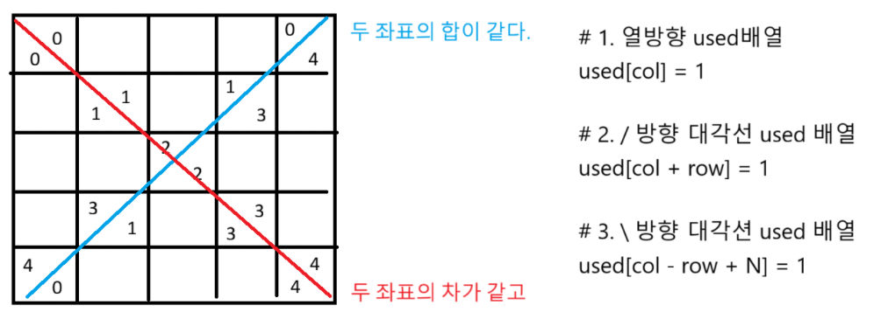

### 이진탐색

```python
def binary_search(arr, target):
    start = 0 # 0번 인덱스
    end = len(arr) - 1 # 끝 요소 인덱스
    flag = 0 # flag처리

    while start <= end: # start와 end가 같아질때까지
        mid = (start + end) // 2
        # 이진 탐색을 통해서 타겟을 찾으면 middle 인덱스 반환
        if arr[mid] == target:
            # return mid
            return True
        # 타겟이 중간값 보다 크면 오른쪽 부분 탐색
        elif arr[mid] < target:
            if flag == 2: break
            flag = 2
            start = mid + 1
        else: # 타겟이 중간값보다 작으면 왼쪽 부분 탐색
            if flag == 1: break
            flag = 1
            end = mid - 1
    # 타겟 못찾으면
    return False

T = int(input())
for tc in range(1, T + 1):
    n, m = map(int, input().split())
    arr = sorted(list(map(int, input().split())))
    b = list(map(int, input().split()))

    cnt = 0
    for num in b:
        cnt += binary_search(arr, num)

    print(f'#{tc} {cnt}')

```

### 과목평가

1. 슬라이딩 윈도우
2. 순열(used 배열) + 백트래킹
3. 서술형 1번 (3-1)
   - 명제를 증명하는데 대우 명제가 참이면 원래 명제가 참이다.
   - 3n + 5가 홀수이면 n은 짝수이다 를 증명하시오.
   - 대우: p이면 q이다 → ~q이면 ~p이다.
   - 대우: n이 홀수면 3n+5 짝수다.
   - 홀수면 n = 2k + 1
   - 3n + 5 = 3(2k + 1) + 5 = 6k + 8 = 2(3k + 4) 로 짝수
   - 대우가 참이므로 원명제도 참이다.
4. 서술형 2번 (3-2)

```javascript
T(n) = T(n - 1) + 1 , T(0) = 1
T(n - 1) = T(n - 2) + 1
T(n) = T(n - 2) + 2 = T(n - k) + k /* K = N 이라고 가정하면 */
     = T(0) + n = n + 1
O(T(n)) = O(n + 1) = O(n)
```

### 백트래킹 부분집합

```python
arr = ['O', 'X']
path = []
name = [1, 2, 3, 4, 5, 6, 7, 8, 9, 10]

def recur(lev):
    sum_v = 0
    # 현재까지 합계 계산
    for i in range(len(path)):
        if path[i] == 'O':
            sum_v += name[i]

    # 가지치기 (시간복잡도상 효율적)
    if sum_v > 10: return

    if lev == 10: # level : 10
        if sum_v == 10:
            # 정점 레벨에 도달했을 때 출력
            for i in range(len(path)):
                if path[i] == 'O':
                    print(name[i], end = ' ')
            print()
        return

    for i in range(2): # branch : 2
        path.append(arr[i])
        recur(lev + 1)
        path.pop()

recur(0)
```

### N Queen



```python
# 1. 열방향 used배열
used = [0] * 20
# 2. / 방향 대각선 used 배열
used1 = [0] * 100
# 3. \ 방향 대각션 used 배열
used2 = [0] * 100

def dfs(row):
    global cnt
    # 정점 노드에 도달했을때
    if row == N:
        cnt += 1
        return

    for col in range(N):
        # 열 방향 : 열방향에 queen이 있다
        if used[col] == 1: continue
        # / 방향 : /방향에 queen이 있다
        if used1[col + row] == 1: continue
        # \ 방향 : \방향에 queen이 있다.
        if used2[col - row + N] == 1: continue

        used[col] = 1
        used1[col + row] = 1
        used2[col - row + N] = 1

        dfs(row + 1)

        used[col] = 0
        used1[col + row] = 0
        used2[col - row + N] = 0

cnt = 0
N = int(input())
dfs(0) # 0행부터 시작
print(cnt)
```

### <서기현 행동 설명서>

1. 문제가 어려울 때  
   1-1. 혼잣말 개많이 함(중얼중얼)  
   1-2. 뭔데?  
   1-3. 설마 이거라고?  
   1-4. 왓?
   1-5. 정신 나갈거 같다.  
   1-6. 다리떨기  
   1-7. 간식 먹음 (갖다주면 좋아함)  
   1-8. 하다가 결국 품. 그러면 3으로 감 (재귀호출)

2. 문제가 전혀 안풀리는 노답 상황일때  
   2-1. 딥슬립 15분~20분 정도 취함  
   2-2. 갑자기 기분전환한다고 내가 못푸는 문제 알려줌(쉽다고) = 개꿀

3. 결국 문제 풀었을 때  
   3-1. 쉽네~  
   3-2. 할만하네~  
   3-3. 이거지.  
   3-4. 별거 없네.  
   3-5. 기분 좋아져서 내가 못푸는 문제 알려줌 = 개꿀

4. 교실이 시끄러울때  
   4-1. 한마디할까?  
   4-2. 커피메이트 올릴까? (입벌구)
