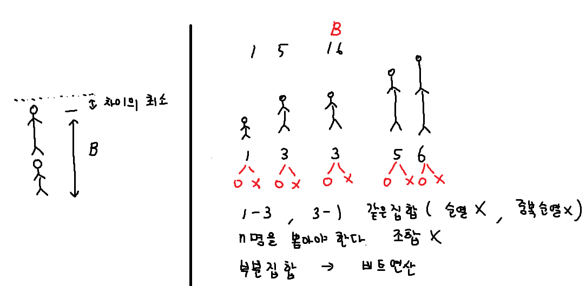
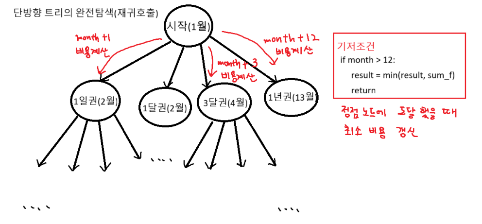
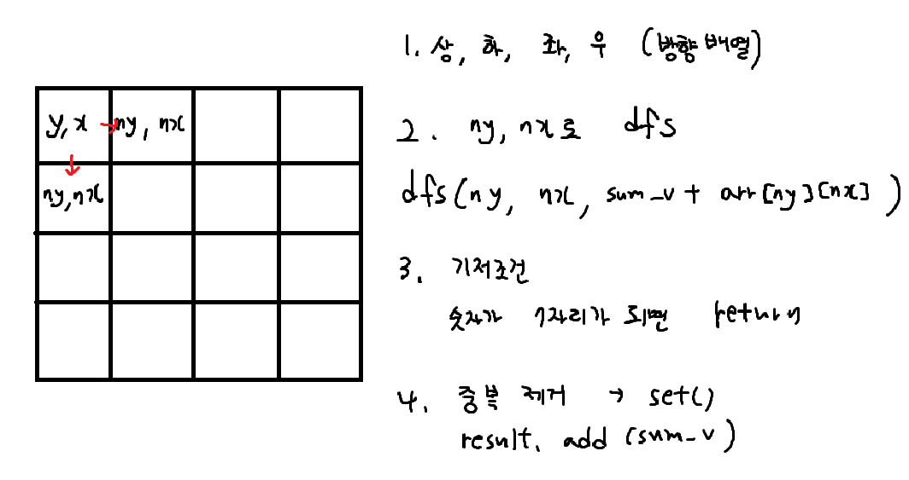

### 장훈이의 높은 선반



```python
# 1. 부분집합 핵심 로직 : 비트연산

for i in range(N):
    if tar & 0x1: # 마지막 비트가 1인지 확인
        sum_v += heights[i]
    tar >>= 1 # target을 오른쪽으로 밀면서

# 우리가 구하려는건 높이의 최소값 X -> 차이의 최소값
diff = sum_v - B
```

### 수영장



```python
def recur(month, sum_v):
    global result
    if month > 12: # 기저조건
        result = min(result, sum_v) # 최소비용 갱신
        return

    # 1일 이용권
    recur(month + 1, sum_v + (plans[month] * cost[0]))
    # 1달 이용권
    recur(month + 1, sum_v + cost[1])
    # 3달 이용권
    recur(month + 3, sum_v + cost[2])
    # 1년 이용권
    recur(month + 12, sum_v + cost[3])

T = int(input())
for tc in range(1, T + 1):
    cost = list(map(int, input().split())) # 이용권 가격
    plans = [0] + list(map(int, input().split()))# 월별 이용 계획 (1월부터)
    result = float('inf')
    recur(1, 0) # 1월부터 시작, 0원부터 시작
    print(f'#{tc} {result}')
```

### 격자판 숫자 이어 붙이기



```python
dy = [-1, 1, 0, 0]
dx = [0, 0, -1, 1]

def dfs(y, x, sum_v):
    # 길이가 7이면 return (기저조건)
    if len(sum_v) == 7:
        result.add(sum_v) # 세트(중복제거)
        return

    for i in range(4): # 4방향
        ny = y + dy[i]
        nx = x + dx[i]

        if 0 > ny or 0 > nx or ny >= 4 or nx >= 4: continue
        dfs(ny, nx, sum_v + arr[ny][nx])

T = int(input())
for tc in range(1, T + 1):
    arr = [input().split() for _ in range(4)]
    result = set()
    # 시작지점 - 임의의 좌표
    for y in range(4):
        for x in range(4):
            dfs(y, x, arr[y][x])
    print(f'#{tc} {len(result)}')
```
