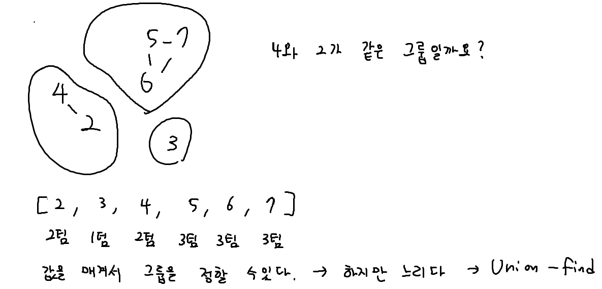
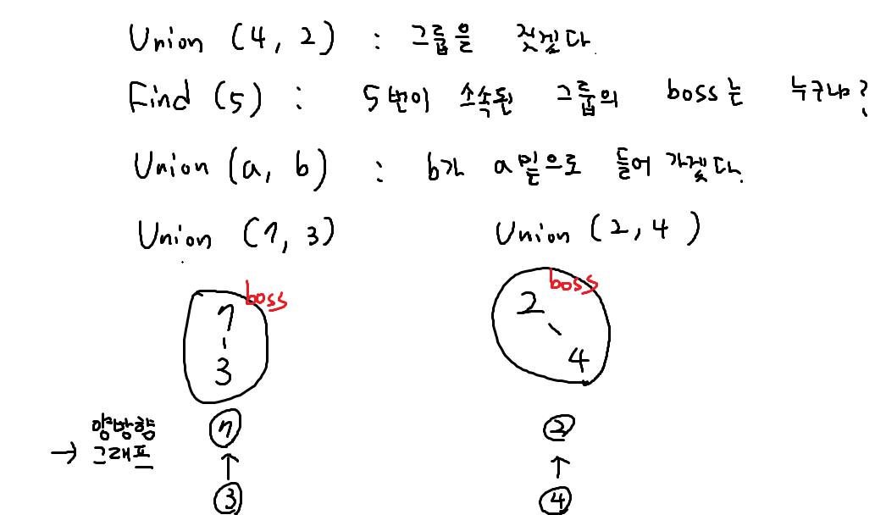
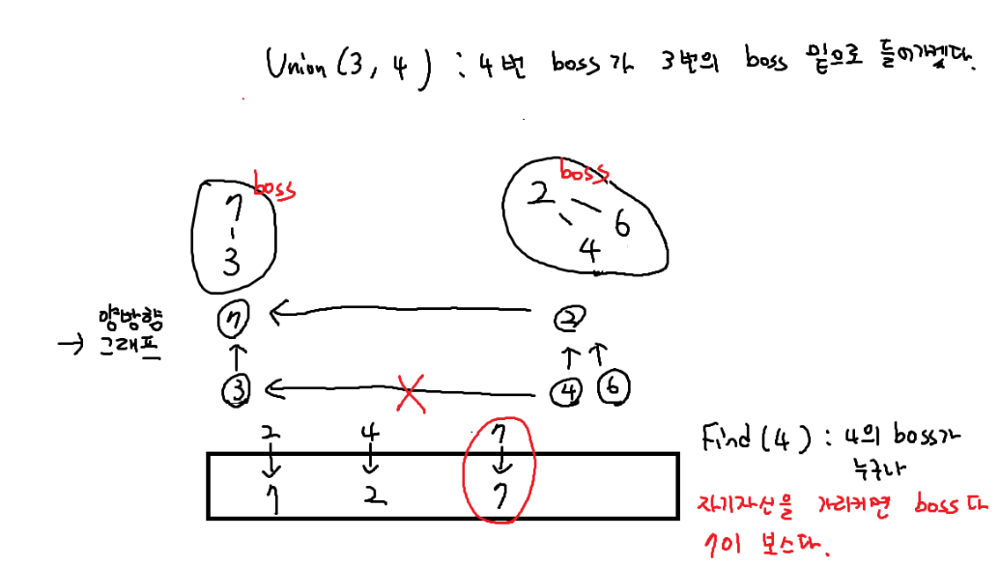

## Union-find





```python
boss = [i for i in range(10)]


def Find(n):
    if boss[n] == n: # 가리키는 보스가 자기 자신이면
        return n # 최종 보스다

    result = Find(boss[n]) # 재귀호출
    boss[n] = result # 경로압축(이 코드를 추가하면서 더 효율적)
    return result

# def Find(n):
#     if boss[n] != n: # 가리키는 보스가 자기 자신이면
#         boss[n] = Find(boss[n]) # 재귀호출 + 경로압축
#
#     return boss[n]

def Union(t1, t2):
    a = Find(t1) # t1의 보스는 a다
    b = Find(t2) # t2의 보스는 b다
    if a == b: return # 이미 보스가 같으면 : 탈락 (return)
    boss[b] = a # b의 보스가 a다

Union(6, 7)
Union(5, 6)
Union(1, 2)

a, b = map(int, input().split())
# 논리 : 보스가 같으면 같은 그룹이다.
if Find(a) == Find(b): print('O')
else: print('X')
```


