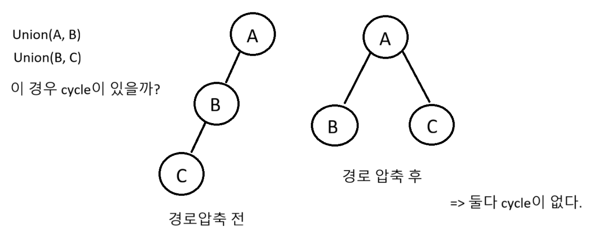
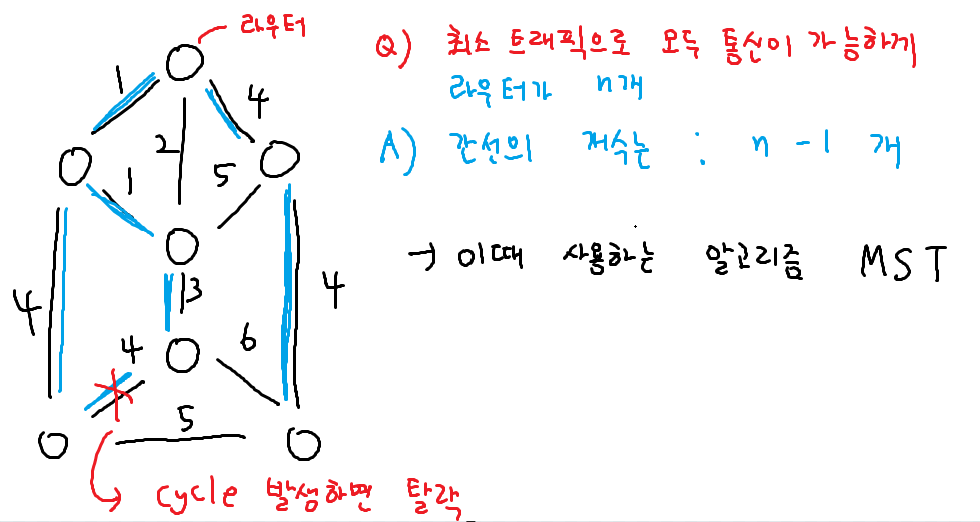
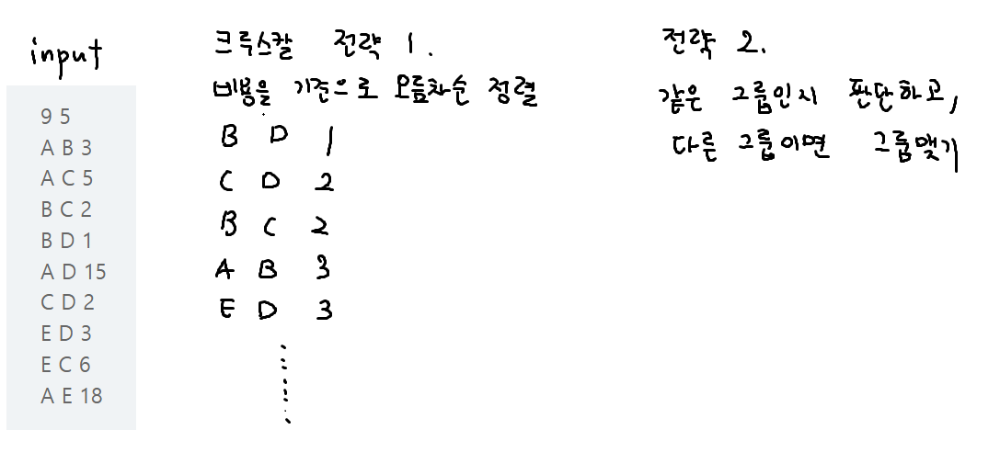

### Union-Find 준비

```python
boss = [i for i in range(10)]

def Find(n):
    if boss[n] == n: # 가리키는 보스가 자기자신이라면
        return n # 최종 보스다

    result = Find(boss[n]) # 재귀호출
    boss[n] = result # 경로압축
    return result

def Union(t1, t2):
    a = Find(t1)
    b = Find(t2)
    if a == b: return # 이미 보스가 같으면 탈락
    boss[b] = a # b의 보스는 a다

Union(6, 7)
Union(5, 6)
Union(1, 2)

a, b = map(int, input().split())
# 논리 : 보스가 같으면 같은 그룹이다.
if Find(a) == Find(b): print('O')
else: print('X')
```

### Union-Find 시작 1

```python
boss = [i for i in range(10)]

def Find(n):
    if boss[n] == n:
        return n
    result = Find(boss[n])
    boss[n] = result
    return result

def Union(t1, t2):
    a = Find(t1)
    b = Find(t2)
    if a == b: return
    boss[b] = a

N = int(input())
for _ in range(N):
    a, b = map(int, input().split())
    # 그룹맺기
    Union(a, b)

M = int(input())
for _ in range(M):
    a, b = map(int, input().split())
    # 보스가 같으면 같은 그룹
    if Find(a) == Find(b): print('O')
    else: print('X')
```

### Union-Find 시작 2 cycle 판단




## MST



## 크루스칼 알고리즘



### 크루스칼 예제 1 친구 네트워크

```python
def Find(n):
    if boss[n] == n: return n
    result = Find(boss[n]) # 재귀호출
    boss[n] = result # 경로압축
    return result

def Union(t1, t2):
    a = Find(t1)
    b = Find(t2)
    if a == b: return
    boss[b] = a

boss = [i for i in range(100)]
members = []
cnt = 0
sum_v = 0

n, node = map(int, input().split()) #n: 친구 관계, node:노드의 개수

# 구현 1번 : 비용을 기준으로 정렬
for _ in range(n):
    a, b, price = input().split()
    a, b = ord(a), ord(b)
    price = int(price)
    members.append((price, a, b)) # price를 첫번째 요소로
members.sort()

# 구현 2. 다른 그룹이면 그룹 맺기
for price, a, b in members:
    if Find(a) == Find(b): continue
    Union(a, b)
    cnt += 1
    sum_v += price

print(sum_v)
```

### 크루스칼 예제 2

```python
def Find(n):
    if boss[n] == n: return n
    result = Find(boss[n]) # 재귀호출
    boss[n] = result # 경로압축
    return result

def Union(t1, t2):
    a = Find(t1)
    b = Find(t2)
    if a == b: return
    boss[b] = a

N, M = map(int, input().split())
boss = [i for i in range(N + 1)]
gender_input = input().split()
# 노드가 1번부터
gender = [0] + gender_input

# 전략 1번 : 비용을 기준으로 오름차순 정렬
edges = []
for _ in range(M):
    a, b, cost = map(int, input().split())
    edges.append((a, b, cost))
# 비용 기준으로 정렬(람다함수)
edges.sort(key=lambda x : x[2])

sum_cost = 0
cnt = 0

# 전략 2. 다른그룹이면 그룹맺기, 다른 성별이면 그룹맺기
for a, b, cost in edges:
    if Find(a) == Find(b): continue
    if gender[a] == gender[b]: continue
    cnt += 1
    sum_cost += cost
    Union(a, b)

if cnt == N - 1: print(sum_cost)
else: print(-1)
```
