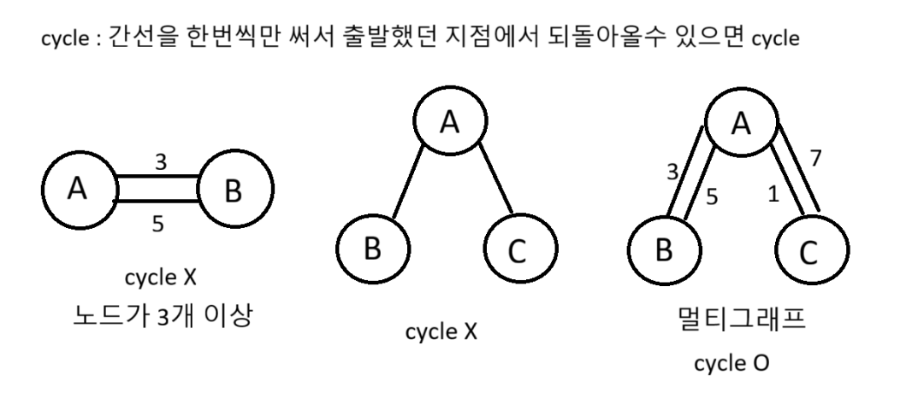

### Union-Find 준비

```python
boss = [i for i in range(10)]

def Find(n):
    if boss[n] == n: # 가리키는 보스가 자기자신이라면
        return n # 최종 보스다

    result = Find(boss[n]) # 재귀호출
    boss[n] = result # 경로압축
    return result

def Union(t1, t2):
    a = Find(t1)
    b = Find(t2)
    if a == b: return # 이미 보스가 같으면 탈락
    boss[b] = a # b의 보스는 a다

Union(6, 7)
Union(5, 6)
Union(1, 2)

a, b = map(int, input().split())
# 논리 : 보스가 같으면 같은 그룹이다.
if Find(a) == Find(b): print('O')
else: print('X')
```

### Union-Find 시작 1

```python
boss = [i for i in range(10)]

def Find(n):
    if boss[n] == n:
        return n
    result = Find(boss[n])
    boss[n] = result
    return result

def Union(t1, t2):
    a = Find(t1)
    b = Find(t2)
    if a == b: return
    boss[b] = a

N = int(input())
for _ in range(N):
    a, b = map(int, input().split())
    # 그룹맺기
    Union(a, b)

M = int(input())
for _ in range(M):
    a, b = map(int, input().split())
    # 보스가 같으면 같은 그룹
    if Find(a) == Find(b): print('O')
    else: print('X')
```

### Union-Find 시작 2 cycle 판단


