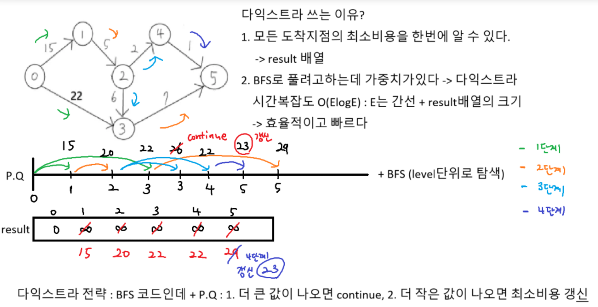

### 하나로 (크루스칼 알고리즘) 전략

```python
def Find(n):
    if boss[n] == n: return n # 자기자신이라면 boss
    result = Find(boss[n]) # 재귀호출
    boss[n] = result # 경로압축
    return result

def Union(t1, t2):
    # t2의 보스가 t1의 보스 밑으로 들어간다
    a = Find(t1)
    b = Find(t2)
    if a == b: return # 이미 같은 그룹이면 탈락
    boss[b] = a

# 구현 1. 비용을 기준으로 오름차순 정렬
# 구현 2. 다른그룹이면 그룹맺기
# 두 섬 사이의 거리 계산
dist = (x[i] - x[j]) ** 2 + (y[i] - y[j]) ** 2
cost = E * dist
```

### 하나로 풀이

```python
def Find(n):
    if boss[n] == n: return n # 자기자신이라면 boss
    result = Find(boss[n]) # 재귀호출
    boss[n] = result # 경로압축
    return result

def Union(t1, t2):
    # t2의 보스가 t1의 보스 밑으로 들어간다
    a = Find(t1)
    b = Find(t2)
    if a == b: return # 이미 같은 그룹이면 탈락
    boss[b] = a


T = int(input())
for tc in range(1, T + 1):
    N = int(input())
    x = list(map(int, input().split()))
    y = list(map(int, input().split()))
    E = float(input()) # 환경 부담 세율

    boss = [i for i in range(N)]
    members = []
    cnt = 0 # 선택된 간선의 개수
    sum_v = 0 # 총 환경 부담금

    # 구현 1. 비용을 기준으로 오름차순 정렬
    for i in range(N):
        for j in range(i + 1, N):
            dist = (x[i] - x[j]) ** 2 + (y[i] - y[j]) ** 2
            cost = E * dist
            members.append((cost, i, j))
    members.sort()
    # 구현 2. 다른그룹이면 그룹맺기
    for cost, a, b in members:
        if Find(a) == Find(b): continue
        Union(a, b)
        cnt += 1
        sum_v += cost

    print(f'#{tc} {round(sum_v)}')

```

## 다익스트라



### 다익스트라 기본 코드

```python
import heapq

MAP = [[0] * 6 for _ in range(6)]
MAP[0][1] = 15
MAP[0][3] = 22
MAP[1][2] = 5
MAP[2][3] = 6
MAP[2][4] = 2
MAP[3][5] = 7
MAP[4][5] = 1

def dijkstra(start):
    n = len(MAP) # 노드의 개수 6개
    result = [float('inf')] * n
    result[start] = 0 # 시작 노드
    # PQ 초기화
    q = [(0, start)] # 비용, 노드

    while q: # PQ가 빌때까지 반복
        # 1. 힙에서 뺀다(탐색)
        price, now = heapq.heappop(q) # 최소 비용

        if result[now] < price: continue # 더 큰값 나오면 continue

        # 2. 다음 갈곳 예약 걸기(힙 등록)
        for i in range(n):
            if MAP[now][i] == 0: continue
            next_price = MAP[now][i] # 다음 노드까지 비용
            price_sum = price + next_price # 비용이 누적
            if result[i] > price_sum: # 더 작은 비용 나오면 갱신
                result[i] = price_sum
                # 힙등록 price_sum은 시작노드부터 i번 노드까지
                heapq.heappush(q, (price_sum, i))

    return result

result = dijkstra(0) # start가 0번노드
print(*result)
```
