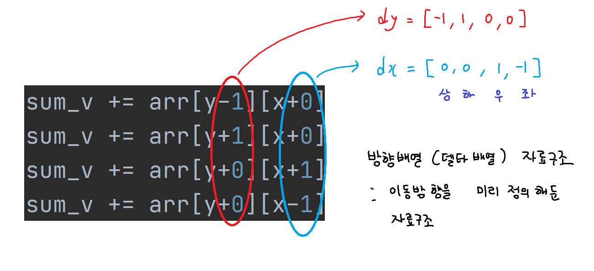
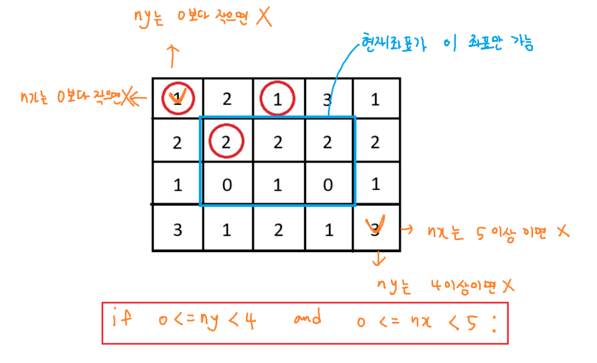

### 델타


```python
arr = [
    [1, 2, 1, 3, 1],
    [2, 2, 2, 2, 2],
    [1, 0, 1, 0, 1],
    [3, 1, 2, 1, 3]
]
y = 1
x = 2
sum_v = 0
# sum_v += arr[y-1][x+0] # 위
# sum_v += arr[y+1][x+0] # 아래
# sum_v += arr[y+0][x+1] # 오른쪽
# sum_v += arr[y+0][x-1] # 왼쪽

# print(sum_v)

# 상하좌우 방향배열 자료구조
# d : direction의 약자
dy = [-1, 1, 0, 0]
dx = [0, 0, -1, 1]

# 방향이 4방향
# ny : next y, y : 현재좌표 , dy : 방향배열
for i in range(4):
    ny = y + dy[i] # next y, x
    nx = x + dx[i] # 위, 아래, 오른쪽, 왼쪽
    sum_v += arr[ny][nx]

print(sum_v)
```



```python
arr = [
    [1, 2, 1, 3, 1],
    [2, 2, 2, 2, 2],
    [1, 0, 1, 0, 1],
    [3, 1, 2, 1, 3]
]
y = 0
x = 1
sum_v = 0
# sum_v += arr[y-1][x+0] # 위
# sum_v += arr[y+1][x+0] # 아래
# sum_v += arr[y+0][x+1] # 오른쪽
# sum_v += arr[y+0][x-1] # 왼쪽

# print(sum_v)

# 상하좌우 방향배열 자료구조
# d : direction의 약자
dy = [-1, 1, 0, 0]
dx = [0, 0, -1, 1]

# 방향이 4방향
# ny : next y, y : 현재좌표 , dy : 방향배열
for i in range(4):
    ny = y + dy[i] # next y, x
    nx = x + dx[i] # 위, 아래, 오른쪽, 왼쪽

    # 첫 번째 코드
    # if 0 <= ny < 4 and 0 <= nx < 5:
    #     sum_v += arr[ny][nx]

    # 두 번째 코드
    # 범위를 벗어나면 sum_v를 계산하지않고 반복문 처음으로 돌아간다 -> continue
    if ny < 0 or ny >= 4 or nx < 0 or nx >= 5: continue
    sum_v += arr[ny][nx]
    # 들여쓰기를 하나라도 줄여준다.
    # 가독성이 좋은 코드

print(sum_v)

```