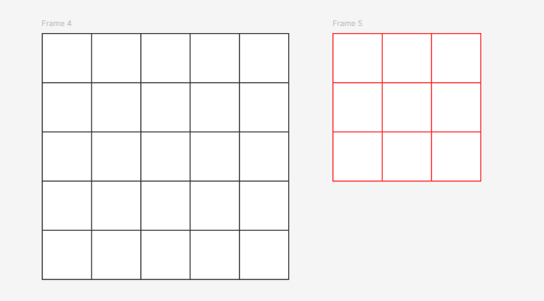
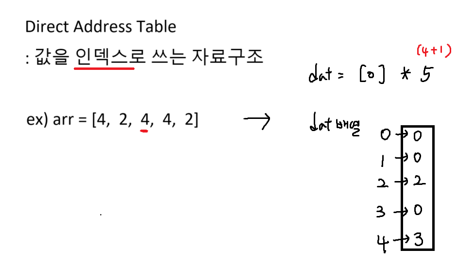

## 과목평가 예상문제

### 1번 행순회

``` python
# N = 5, M = 3, K =3
for y in range(N - M + 1): # 행순회
    for x in ragne(N - M + 1)
```

### 2번 방향배열
1. 범위 안에 다 있어야함
2. 가운데 값이 가장 큰 값이면 cnt += 1


### 서술형 문제
틀린 부분 두개를 찾아라
``` python
arr = [5,1,4,2,8]

n = len(arr)
for i in range(n):
    for j in range(i):
        if arr[j] < arr[j+1]:
            arr[j], arr[j+1] == arr[j+1], arr[j]
```


- 버블 정렬 시험에 나온다.


### flag 처리

``` python
# flag처리 : flag변수를 bool타입 변수로 활용
# for - break --->  break를 함수의 return으로 바꾼다.
# Q) arr1과 arr2가 같은지 판별하세요?

arr1 = [1, 4, 2, 5]
arr2 = [1, 4, 3, 5]
flag = 0 # false로 초기화

for i in range(4):
    if arr1[i] != arr2[i]: # 하나라도 같지 않으면
        flag = 1
        break

if flag: print('X')
else: print('O')

arr1 = [1, 4, 2, 5]
arr2 = [1, 4, 3, 5]

def is_same():
    for i in range(4):
        if arr1[i] != arr2[i]:
            return 1 # 하나라도 같지 않으면 return 1
    return 0 # 모두 같으면 return 0

result = is_same()

if result: print('X')
else: print('O')

```


### DAT 준비 1

``` python
# flag 처리
A = [4, 2, 5, 3, 7, 6]
B = [5, 3, 7]

n = int(input())

flag = 1
for i in range(3):
    if A[i+n] != B[i]:
        flag = 0
        break
        
if flag: print('O')
else: print('X')

# is_same() 함수
A = [4, 2, 5, 3, 7, 6]
B = [5, 3, 7]

def is_same(n):
    for i in range(3):
        if A[n+i] != B[i]: return 0

    return 1

n = int(input())
result = is_same(n)
if result: print('O')
else: print('X')

```


### DAT 준비 2

``` python
A = [5, 7, 5, 4, 2, 9]
B = [5, 4, 2, 5, 6]

def is_exist(n): # 존재하면 1, 아니면 0 return
    for i in range(5):
        if B[i] == n: return 1

    return 0

for i in range(6):
    if is_exist(A[i]): print('O', end = ' ')
    else: print('X', end = ' ')
```


### DAT 준비 4

``` python
A = [
    [5, 5, 2, 6],
    [9, 1, 1, 3]
]
tar = [5, 6, 1, 1, 1, 1, 5, 4]

def get_count(n):
    cnt = 0
    for i in range(len(tar)):
        if tar[i] == n: cnt += 1
    return cnt

for y in range(2):# 행순회
    for x in range(4):
        result = get_count(A[y][x])
        print(result, end = ' ')
    print()
```

### DAT 이란

``` python
A = [4, 2, 4, 4, 2]

dat = [0] * (4 + 1)
idx = 0

for i in range(len(A)):
    idx = A[i] # 값을 인덱스로
    dat[idx] += 1 # counting

# print(dat)
for i in range(len(A)):
    if dat[i] > 0: print(f'{i} : {dat[i]}')

# 만약 값이 string이면 인덱스로 어떻게 쓸까??
# Q) "BTSKFCBBQ" 문자열에서 각 알파벳이 몇개 씩 있을까?
# A) 아스키코드로 변환

text = "BTSKFCBBQ"

dat = [0] * 200 # 0 ~ 199까지의 인덱스(소문자 a의 아스키코드 97)
for i in range(len(text)):
    dat[ord(text[i])] += 1 # 값(아스키코드)을 인덱스로

for i in range(200):# 0 ~ 199
    if dat[i] == 0: continue
    print(f'{chr(i)} : {dat[i]}')
```

### DAT 시작 1
``` python
arr = [
    [1, 5, 10, 15],
    [15, 15, 20, 30]
]

dat = [0] * 31 # 인덱스를 0부터 30까지 쓸거니까 (31개)

for y in range(2): # 행순회
    for x in range(4):
        dat[arr[y][x]] += 1 # 값을 인덱스로 쓴다

n = int(input())
print(dat[n])
```


### DAT 시작 2
``` python
text = 'ABCDE'

dat = [0] * 200

arr = list(input().split())

# 과정 1. dat 채우기
for i in range(len(text)):
    dat[ord(text[i])] = 1 # 문자 아스코드값을 dat의 인덱스로

# 과정 2. 하나씩 검사
for i in range(3):
    ch = arr[i]
    if dat[ord(ch)] == 1: print('O', end = ' ')
    else: print('X', end = ' ')
```

### DAT 시작 3
``` python
text = 'BBQBHCBTS'

dat = [0] * 200

for i in range(len(text)):
    dat[ord(text[i])] += 1 # 알파벳의 아스키코드값을 인덱스로
max_v = 0

for i in range(200):
    if dat[i] > max_v: max_v = dat[i] # 최대값 갱신

print(max_v)

# count메서드나 counting 하는경우 시간복잡도가 O(n제곱)
# dat경우 O(n) : 효율적이다
```