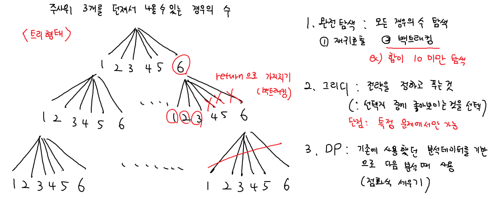
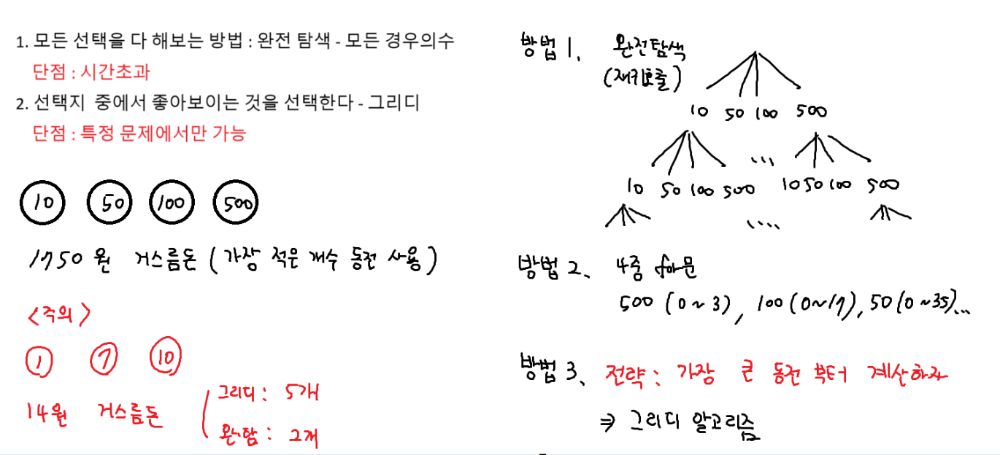
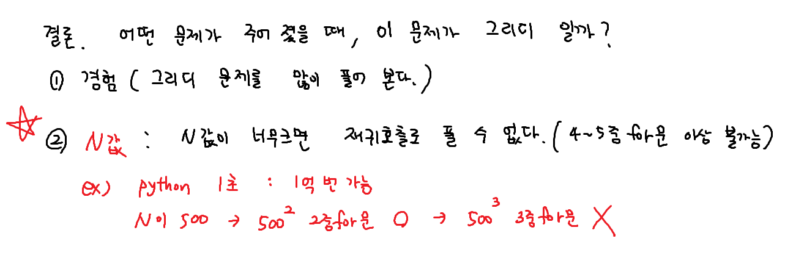
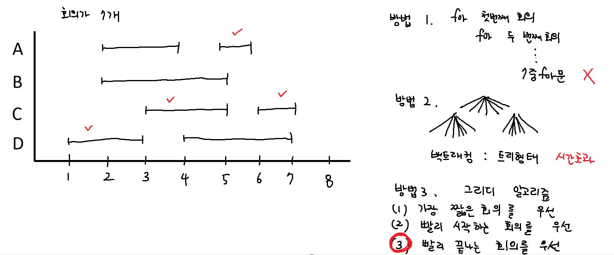

## Greedy








### 거스름돈
``` python
coins = [10, 50, 100, 500]

coins.sort(reverse = True)
# 거스름돈
change = int(input())
cnt = 0

for coin in coins: # 500, 100, 50, 10 순서대로 순회
    # 현재 동전으로 거슬러 줄수있는 개수
    num_coins = change // coin
    # 계산을 이어서 하기위해서는 나머지를(나머지 거스름돈) 알아야 한다.
    change %= coin
    # 총 동전 개수 누적
    cnt += num_coins

print(cnt)
```

### 화장실 대기시간 줄이기
``` python
# 전략 : 가장 시간이 적은사람부터 이용

times = [100, 50, 20, 30, 70]
times.sort() # [20, 30, 50, 70, 100]

# 총 대기시간
total_wait = 0
for i in range(len(times)):
    # 현재 사람의 이용시간 * 뒤에 남아있는 사람
    total_wait += times[i] * (len(times) - i - 1)

print(total_wait)
```

### 막대 블럭 채우기
``` python
# 전략 : 오름차순 정렬 후 합이 100 넘지않을까지 더하기

n = int(input())
blocks = list(map(int, input().split()))

# 오름차순 정렬
blocks.sort()
cnt, total = 0, 0

for block in blocks:
    total += block
    if total > 100: break # counting하기 전에 break
    cnt += 1

print(cnt)
```

### 회의실 배정

``` python
n = int(input()) # 회의 수
meetings = []

for _ in range(n): # 시작시간, 종료시간 입력
    start, end = map(int, input().split())
    meetings.append((start, end))

# 회의가 끝나는 시간을 기준으로 정렬
# 만약 종료시간이 같다면 시작시간이 빠른 순이 우선
meetings.sort(key=lambda x: (x[1], x[0]))


cnt = 1
end_time = meetings[0][1]

for i in range(1, n):
    # 구현!!!
    # 뒤 회의의 시작시간이 앞 회의의 끝나는 시간보다 크거나 같아야 한다
    if meetings[i][0] >= end_time:
        cnt += 1
        end_time = meetings[i][1]

print(cnt)
```

### 액체괴물 놀이
``` python
# 가장 작은 두수(pop)를 선택하기 위해서 정렬(내림차순)
# 더한값을 배열에 다시 넣고(append) 정렬
# 모든수가 하나로 합쳐질 때 까지 반복

N = int(input())
arr = list(map(int, input().split()))
# 내림차순 정렬
arr.sort(reverse=True)

sum_v = 0
while len(arr) > 1: # 1개 이하가 될때까지 반복

    temp = arr.pop() + arr.pop() # 작은거 두개빼서 더하고
    sum_v += temp # 합계 누적

    arr.append(temp) # append로 넣고
    arr.sort(reverse=True) # 다시 정렬하고

print(sum_v)
```

