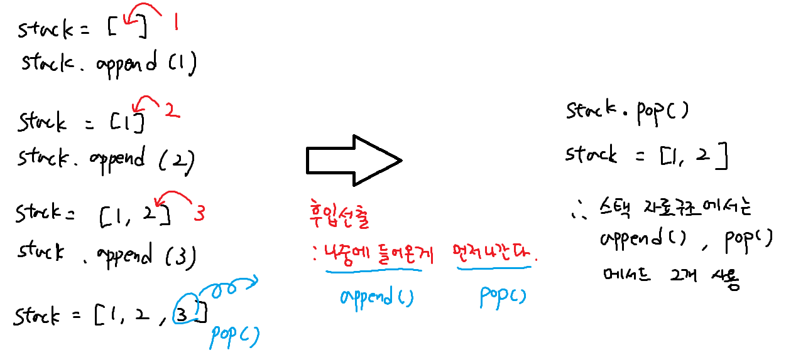
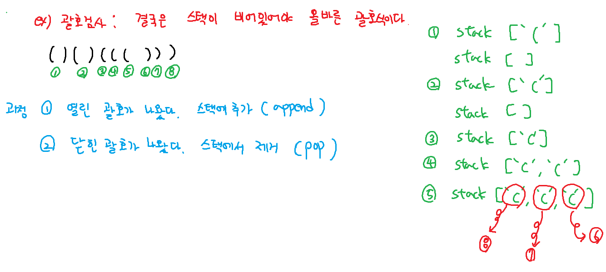

## 스택




``` python
def is_brakets(text):
    stack = []

    for char in text:
        if char == '(': # 여는 괄호면 스택에 추가
            stack.append(char)
        elif char == ')': # 닫는 괄호면
            if not stack: # 스택이 비어있으면 실패
                return False
            stack.pop() # (스택이 비어있지 않으면) 스택에서 여는 괄호 제거

    return len(stack) == 0 # 최종적으로 스택이 비어있어야 올바른 괄호

# 하드코딩
arr = [
    "()()((()))",
    "((()))()()((()))(()"
]
for text in arr:
    if is_brakets(text): print(f'{text}는 올바른 괄호식')
    else: print(f'{text}는 올바르지 않은 괄호식')
```

### 반복문자 지우기 (난이도 low)
1. 처음에 'A' 들어올 때  
   stack = [] (비어있음)
   -> stack.append('A')
   stack = ['A']  

2. 'B' 들어 올 때  
   stack = ['A']
   -> stack.append('B')
   stack = ['A', 'B']

3. 첫 번째 'C'가 들어올 때  
   stack = ['A', 'B']
   -> stack.append('C')
   stack = ['A', 'B', 'C']

4. 두 번째 'C'가 들어올 때   
   스택이 비어있지 않고, 스택의 마지막 문자와 현재문자가 같은지 확인    
   stack = ['A', 'B', 'C']
   stack[-1] == 'C' (마지막 문자와 현재 문자 같음)
   -> stack.pop()
   stack = ['A', 'B']

5. 마지막 'B'가 들어올 때  
   stack = ['A', 'B']
   stack[-1] == 'B' (마지막 문자와 현재 문자가 같음)
   -> stack.pop()
   stack = ['A']
   
``` python
T = int(input())

for tc in range(1, T + 1):
    string = list(input())
    stack = []
    for char in string:
        # 스택이 비어있지 않고, 현재문자와 stack의 마지막 문자와 같다면
        if stack and char == stack[-1]:
            stack.pop()
        else:
            stack.append(char)

    print(f'#{tc} {len(stack)}')
```

### 괄호검사 (난이도 mid)
여는 괄호는 무조건 스택에 넣는다  
닫는 괄호가 나오면 스택의 마지막 요소와 짝이 맞는지 비교  
짝이 맞으면 pop으로 제거, 안 맞으면 스택에 추가  
이 과정을 반복  
최종적으로 스택이 비어있으면 모든 괄호의 짝이 맞다.  
``` python
T = int(input())
for tc in range(1, T + 1):
    text = input()
    stack = []
    for i in text:
        # 1. 여는 괄호면 스택에 추가 (append)
        if i == '{' or i == '(': stack.append(i)
        # 2. 닫는 괄호가 중괄호면 스택이 비어있지않고, 짝이 맞는지 확인 후 제거(pop)
        elif stack and i == '}' and stack[-1] == "{": stack.pop()
        # 3. 닫는 괄호가 소괄호면 스택이 비어있지않고, 짝이 맞는지 확인 후 제거 (pop)
        elif stack and i == ')' and stack[-1] == "(": stack.pop()
        # 4. 닫는 괄호인데 짝이 맞지않다. -> 스택에 추가 (append)
        elif i == '}' or i == ')': stack.append(i)

    if stack: result = 0 # stack이 비어있지 않으면
    else: result = 1 # stack이 비어있으면 (괄호 짝이 다 맞음)

    print(f'#{tc} {result}')
```


### 후위표기법 (난이도 mid)
전략  
피연산자(숫자)는 스택에 추가(append)  
연산자를 만나면 스택에서 두개의 숫자를 pop해서 계산  
(만약 스택에 2개의 숫자가 없다면 error)  
계산결과를 다시 스택에 추가(append)  
마지막 '.' 종료, 스택에 딱 하나의 결과값만 있어야함  

ex) "1 2 + 3 *."

1. '1' -> 스택에 추가 : stack = [1]
2. '2' -> 스택에 추가 : stack = [1, 2]
3. '+' -> 2, 1 pop해서 계산 후 스택에 추가 append -> stack = [3]
4. '3' -> 스택에 추가 : stack = [3, 3]
5. '*' -> 3, 3 pop해서 계산 후 스택에 추가 append -> stack = [9]
6. '.' -> 종료, 결과를 반환 return stack[0] == 9
 
``` python
def get_caculate(arr):
    stack = []
    for i in arr[:-1]: # 마지막을 element를 제외하고 순회
        if i.isdecimal(): # 피연산자면 스택에 넣기
            stack.append(int(i))
        elif i in {'+', '-', '*', '/'}: # 연산자면
            if len(stack) < 2: # pop을 해야되는데 2개 미만이면
                return 'error'
            b = stack.pop()
            a = stack.pop()
            if i == '+': stack.append(a + b) # 계산해서 다시 스택에 넣기
            elif i == '-': stack.append(a - b)
            elif i == '*': stack.append(a * b)
            elif i == '/': stack.append(a // b)
    if len(stack) != 1:
        return 'error'
    return stack[0] # stack에 정수가 1개 있을 떄

T = int(input())
for tc in range(1, T + 1):
    Forth = input().split()
    result = get_caculate(Forth)
    print(f'#{tc} {result}')
```
