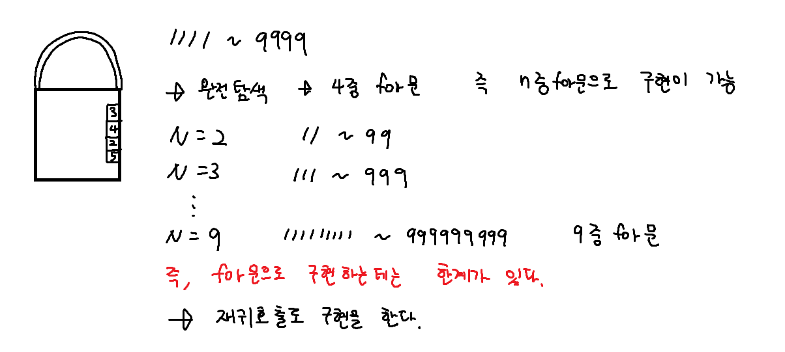
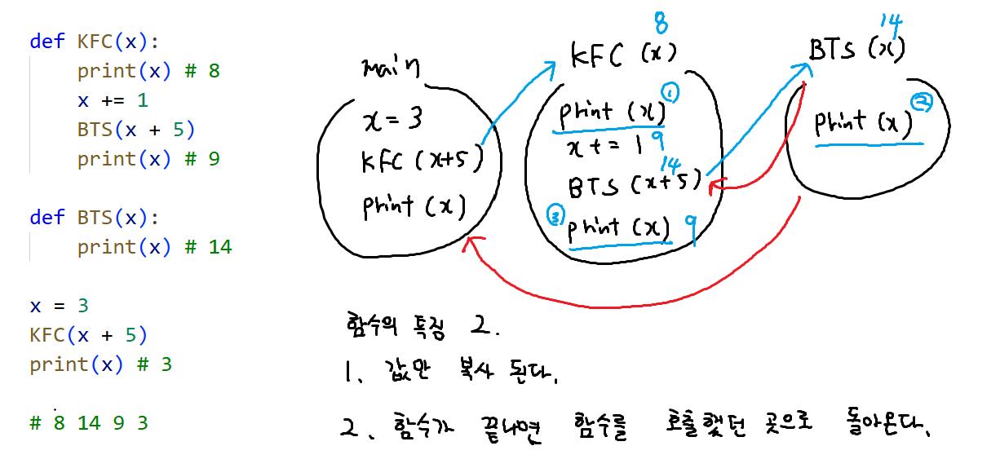
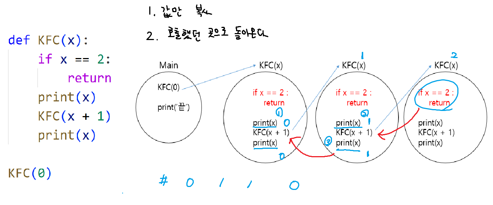
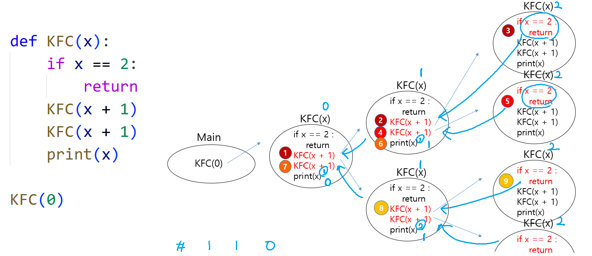
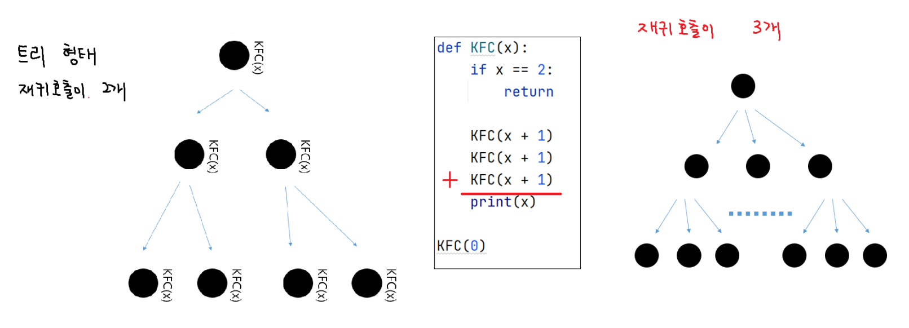
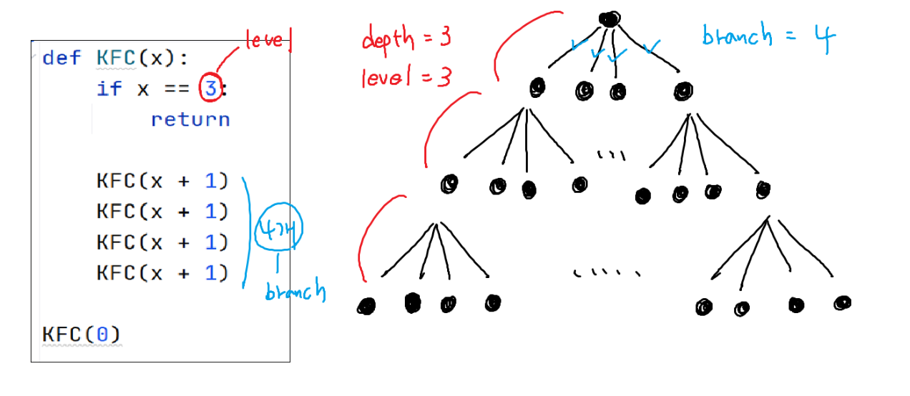
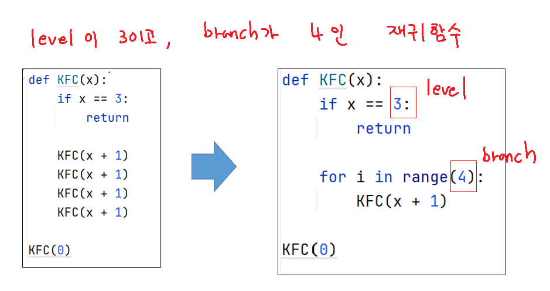

sw 역량 테스트 다음주 화요일

- 2시간 -
im  1문제 (im을 반드시 pass해야 a형을 풀 수 있음)
a형 2문제

im 시험범위
(스택, 큐, 재귀호출, dfs 절대안나옴)

1. 2차원 리스트(범위 순회, 방향 배열)
   : 어려워지면 continue랑 break 잘 써야함
   : for문 뿐만아니라 while문도 잘써야한다 (while break)
   : 함수 잘만들어야 한다. (디버깅)
   : 히든테케 100개 -> 80~90개 통과 나머지는 fail

2. 그리디 알고리즘
   : 나 완전탐색 좀 할줄아는데? 하고 풀어보면 시간초과
   : N값 확인하고 N값이 100이상이다 그러면 4중for문까지만 가능
   : 완전탐색 X, 그리디!!!!

3. Parsing (string)
   : find메서드 잘쓰기
   : 디버깅 잘하기

## 재귀호출

