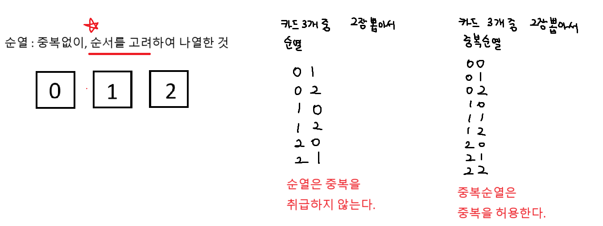
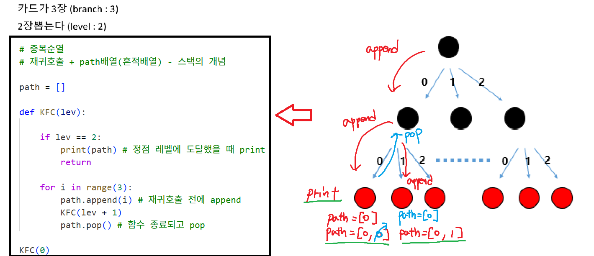
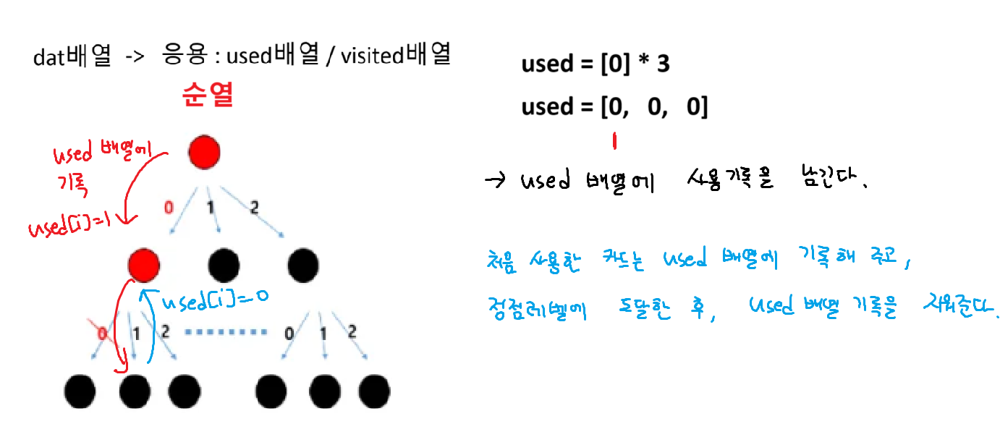
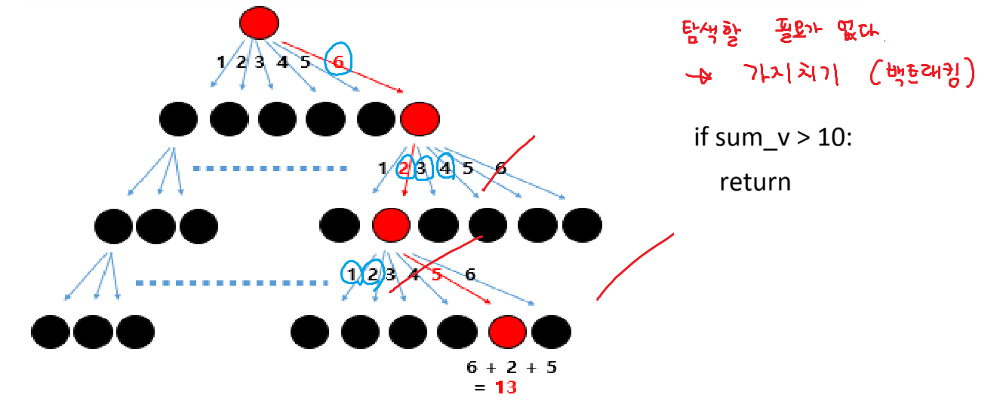
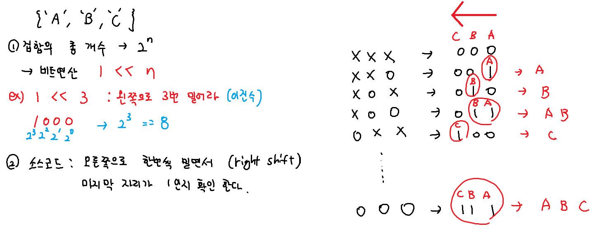
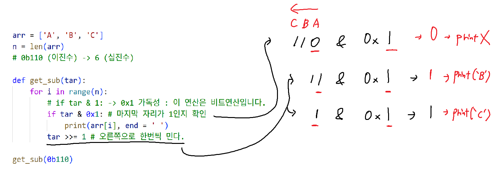
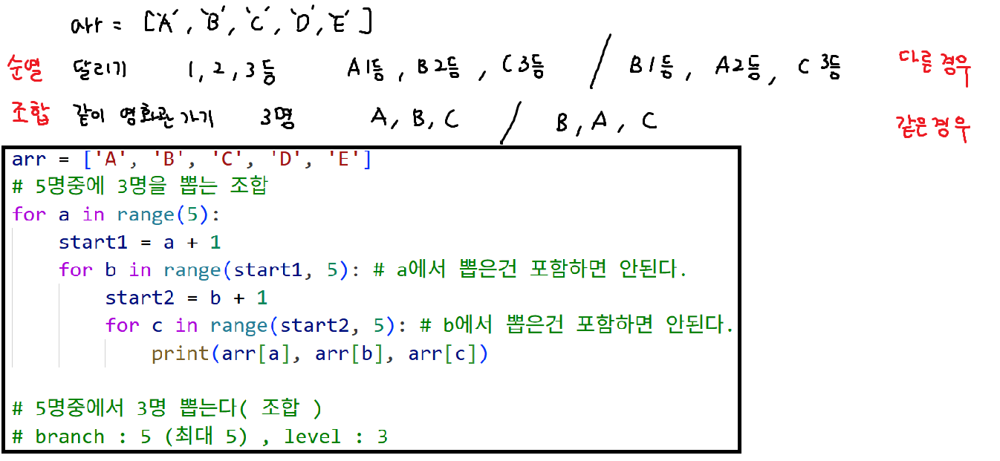

## 순열과 중복순열


### 중복순열

``` python
def KFC(lev):

   if lev == 2:
      print(path)
      return
   for i in range(3):
      path.append(i)
      KFC(lev + 1)
      path.pop()

KFC(0)
```

### 순열코드

``` python
# 순열 코드

path = []
used = [0] * 3

def KFC(lev):
    if lev == 3: # 주사위 3개 던진다.
        print(*path)
        return

    for i in range(1, 7): # 주사위 눈금이 1~6까지 (branch 6)

        # 만약 used배열에 기록이 되어있으면
        # 재귀 호출 하지않는다 : 다음 레벨로 탐색하지 않는다
        if used[i] == 1: continue
        used[i] = 1 # 기록
        path.append(i)
        KFC(lev + 1)
        path.pop()
        used[i] = 0 # 지워준다

KFC(0)
```

### 가지치기 (백트래킹)

``` python
# 가지치기(백트래킹) - 합계가 10보다 크면 탐색자체를 안한다.
if sum_v > 10:
   return
    
if lev == 3: # 주사위 n개 던진다.
   # 합계가 10 이하 일때 합계 출력
   # 느리다. (탐색할 필요가 없다)
   if sum_v <= 10:
      print(sum_v)
      return
```

### [문제] - boss 문제 - 완전 탐색
``` python
path = []
cnt = 0
n = int(input())

def KFC(lev, sum_v): # 재귀호출 될 때마다 합계가 누적
    # cnt = 0 # 재귀호출 할때마다 0으로 초기화
    global cnt

    # 가지치기
    # if sum_v > 10: return

    if lev == n:
        # if sum_v <= 10: cnt += 1 # 비효율적(모든 경우를 다 탐색해서 느리다)
        cnt += 1
        return

    for i in range(1, 7): # branch : 6
        path.append(i)
        KFC(lev + 1, sum_v + i)
        path.pop()

KFC(0, 0) # level, sum_v
print(cnt)
```

### 부분 집합




### [문제] 재귀호출 시작 3 부분집합
``` python
arr = ['O', 'X']
path = []
name = ['Luffy', 'Zoro', 'Sanji']

def print_name():
    for i in range(3):
        if path[i] == 'O':
            print(name[i], end = ' ')
    print()

def KFC(lev):
    if lev == 3: # level : 3
        print_name() # 함수호출(이름출력)
        return

    for i in range(2): # branch : 2
        path.append(arr[i])
        KFC(lev + 1)
        path.pop()

KFC(0)
```


### 부분집합 비트연산 기본 코드
``` python
arr = ['A', 'B', 'C']
n = len(arr)
# 0b110 (이진수) -> 6 (십진수)

def get_sub(tar):
    for i in range(n):
        # if tar & 1: -> 0x1 가독성 : 이 연산은 비트연산입니다.
        if tar & 0x1: # 마지막 자리가 1인지 확인
            print(arr[i], end = ' ')
        tar >>= 1 # 오른쪽으로 한번씩 민다.

for tar in range(1 << n): # 2의 n제곱
    # 0부터 7까지 (000, 001, 010, 011, 100, 101, 110, 111)
    print('{', end = ' ')
    get_sub(tar)
    print('}')
```

### 친구와 카페 방문
``` python
arr = input().split()
n = len(arr)
# 0b110 (이진수) -> 6 (십진수)

def get_sub(tar):
    cnt = 0
    for i in range(n):
        # if tar & 1: -> 0x1 가독성 : 이 연산은 비트연산입니다.
        if tar & 0x1: # 마지막 자리가 1인지 확인
            cnt += 1
        tar >>= 1 # 오른쪽으로 한번씩 민다.
    return cnt

result = 0
for tar in range(1 << n): # 2의 n제곱(모든 부분집합의 개수)
    if get_sub(tar) >= 2: # bit가 2개이상 1이라면,
        result += 1

print(result)
```


## 조합

``` python
arr = ['A', 'B', 'C', 'D', 'E']
path = []
n = 3

def KFC(lev, start):
  if lev == n:
    print(*path)
    return

  for i in range(start, 5):
    path.append(arr[i])
    KFC(lev+1, i+1)
    path.pop()

KFC(0,0)
```