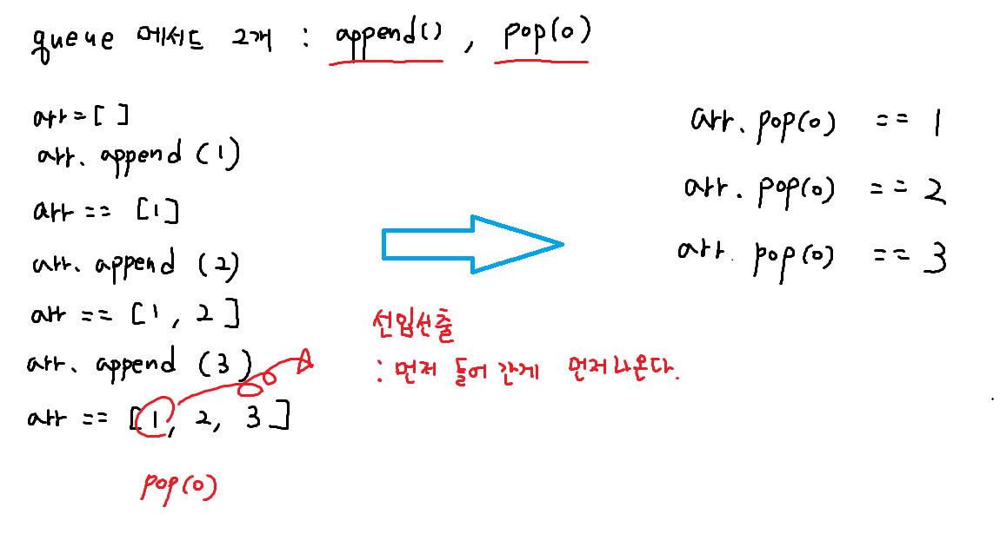
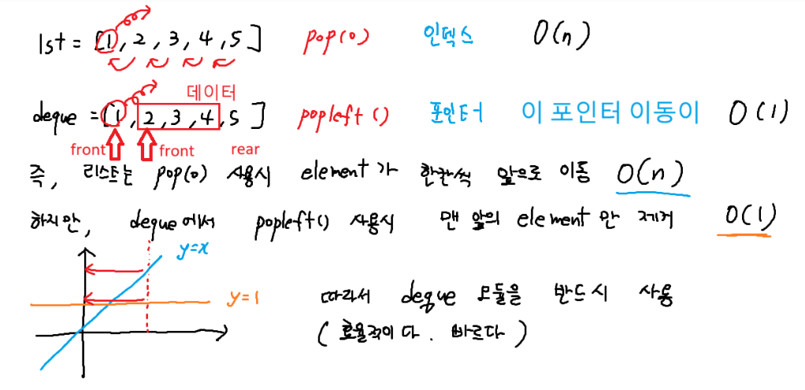
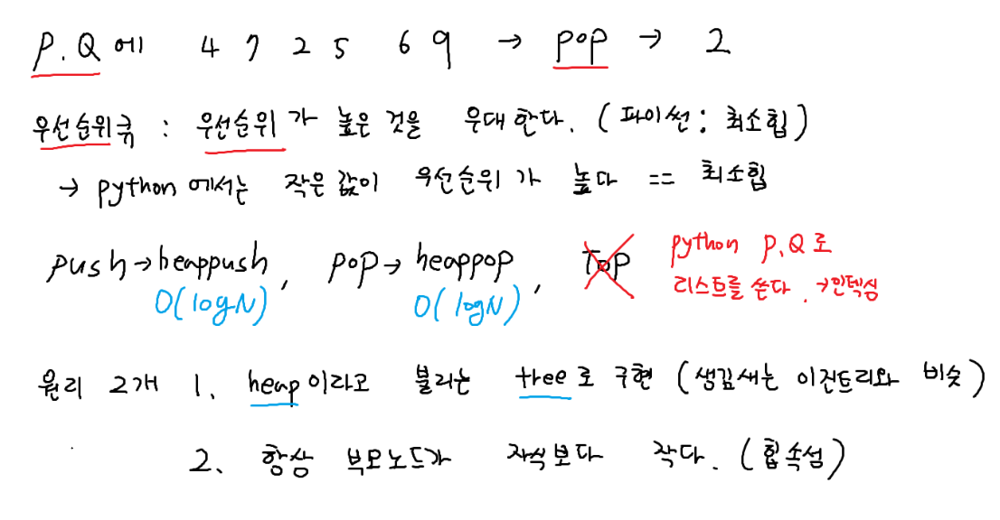
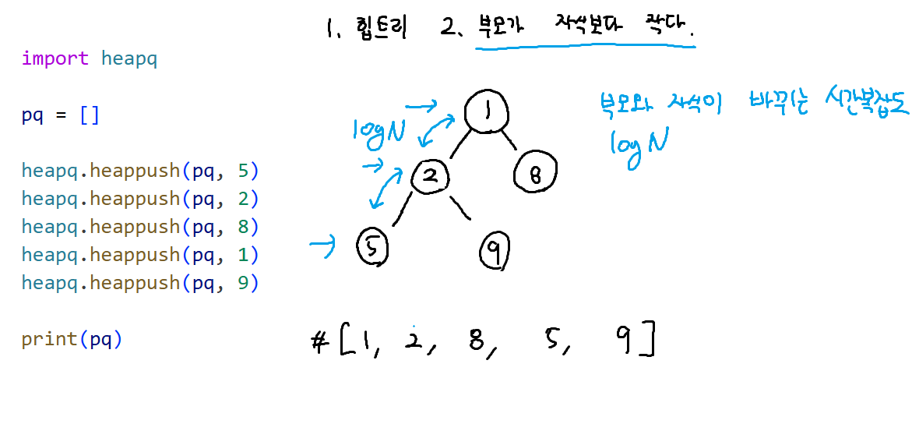
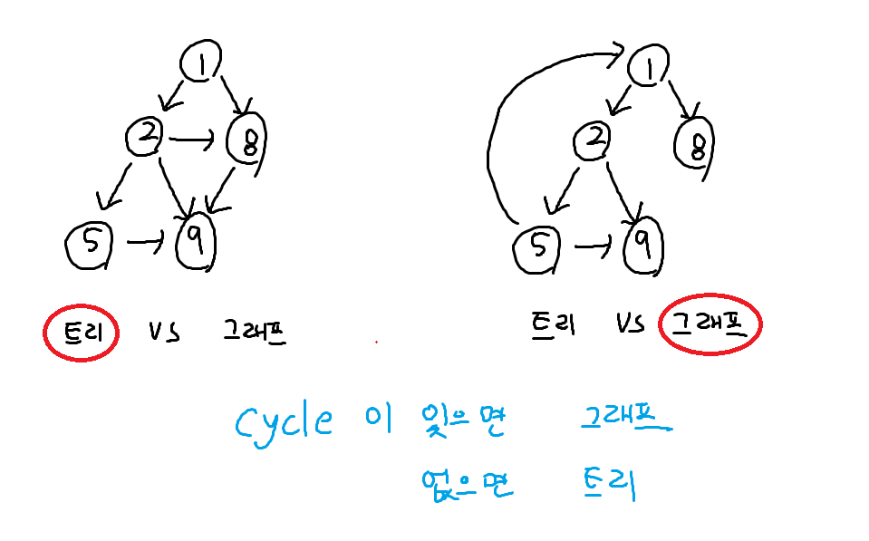

stack이 단독으로 쓰이는 문제는 없다.
재귀호출(정점 레벨-노드)까지 탐색 -> 깊이 우선 탐색(DFS)

queue는 정말 중요!
queue 응용 -> BFS(너비우선탐색)
우선순위큐(priority queue (P.Q)) - 파이썬은 최소힙
BFS + P.Q. : 다익스트라

DFS와 BFS 알고리즘을 쓰려면 
트리나 그래프 자료 구조에서 써야한다.
트리의 종류(이지트리, 힙트리), 트리와 그래프의 차이, 단방향그래프, 양방향 그래프


## queue




### 회전 (난이도 low)
``` python
from collections import deque

T = int(input())
for tc in range(1, T + 1):
    N, M = map(int, input().split())
    arr = deque(map(int, input().split()))

    for i in range(M):
        # 가장 왼쪽 원소를 제거하고, 이 원소를 다시 덱에 넣는다
       arr.append(arr.popleft())

    result = arr[0]
    print(f'#{tc} {result}')
```

### 피자굽기
- 화덕의 맨 앞의 피자를 꺼내서 치즈확인(popleft())
- 치즈의 양 반으로 줄이기 (// : 몫)
- if 치즈가 0이면 새 피자를 화덕에 넣기(oven.append(pizzas.popleft()))
- else : 치즈가 남아있으면 -> 다시 화덕에 넣기 (oven.append())
- 화덕에 피자가 한개 남을때까지 반복 (while문)
- 마지막에 남은 피자 번호 출력 oven[0][0]
- deque == [피자 인덱스, 치즈의 양]

``` python
from collections import deque

T = int(input())
for tc in range(1, T + 1):
    N, M = map(int, input().split()) # N : 화덕 크기, M : 피자 개수
    cheese = list(map(int, input().split()))
    # 인덱스 1부터 시작(+1), 치즈양
    pizzas = deque([[i + 1, p] for i, p in enumerate(cheese)])

    oven = deque() # 화덕
    for _ in range(N): # 처음에 화덕에 피자를 N개 넣음
        if pizzas: oven.append(pizzas.popleft())

    # 화덕에 피자가 한 개 남을때 까지 반복
    while len(oven) > 1:
        now = oven.popleft() # 화덕에서 피자하나 꺼냄
        # now = [피자인덱스, 치즈의양]
        now[1] //= 2 # 꺼낸 피자의 치즈 양을 절반으로 줄이고
        if now[1] == 0: # 치즈가 모두 녹았다면
            if pizzas: # 남은 피자가 있으면
                oven.append(pizzas.popleft()) # 새 피자 넣기
        else: # 치즈가 아직 남아있다면 다시 화덕에 넣기
            oven.append(now)

    # while문 종료후 피자 한개만 남아있음. 피자의 번호 출력
    # [피자인덱스, 치즈의 양]
    print(f'#{tc} {oven[0][0]}')
```


## 우선순위 큐


## 힙트리

``` python
import heapq

pq = []
heapq.heappush(pq, 5)
heapq.heappush(pq, 2)
heapq.heappush(pq, 8)
heapq.heappush(pq, 1)
heapq.heappush(pq, 9)

print(pq) # [1, 2, 8, 5, 9] # 힙 트리

sorted_arr = []

while pq: # pq가 빌때까지 반복 -> heap sort
    sorted_arr.append(heapq.heappop(pq))

print(sorted_arr) 

```

### 트리 vs 그래프
트리는 시작점으로 돌아가지 못한다. 
