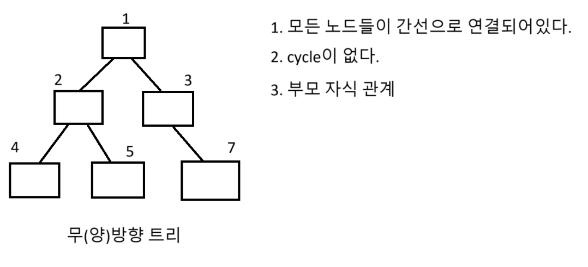
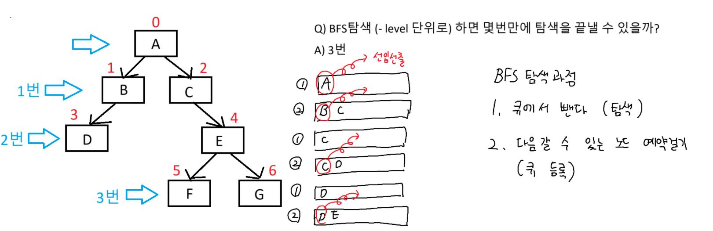

## 트리




### 이진트리


### 전위순회
``` python
# 전위순회 (현재노드 -> 왼쪽자식노드 -> 오른쪽자식노드)

bt = [0, 'A', 'B', 'T', 'R', 'S', 'V']
bt += [0] * 100

def dfs(now): # now는 현재노드
    # 전위순회를 하다가
    # 왼쪽자식으로 갔는데 8이다. 8번인덱스에는 노드가 없다. - return
    # 오른쪽자식으로 갔는데 9이다. 9번 인덱스에는 노드가 없다. - return
    # 13이야 잘못들어갔어 return
    if bt[now] == 0: return

    # print(bt[now])# 현재 노드 먼저 방문
    dfs(now * 2) # 왼쪽 자식 노드 방문
    dfs(now * 2 + 1)# 오른쪽 자식 노드 방문

dfs(1)
```

### 중위순회
``` python
# 중위순회 (왼쪽 자식 노드 -> 현재 노드 -> 오른쪽 자식 노드)

bt = [0, 'A', 'B', 'T', 'R', 'S', 'V']
bt += [0] * 100

def dfs(now): # now는 현재노드

    if bt[now] == 0: return

    # dfs(now * 2)  # 왼쪽 자식 노드 방문
    print(bt[now])# 현재 노드 먼저 방문
    dfs(now * 2 + 1)# 오른쪽 자식 노드 방문

dfs(1)
```

### 후위순회
``` python
# 후위순회 (왼쪽 자식 노드 -> 오른쪽 자식 노드 -> 현재 노드)

bt = [0, 'A', 'B', 'T', 'R', 'S', 'V']
bt += [0] * 100

def dfs(now): # now는 현재노드

    if bt[now] == 0: return

    dfs(now * 2)  # 왼쪽 자식 노드 방문
    dfs(now * 2 + 1)  # 오른쪽 자식 노드 방문
    print(bt[now])# 현재 노드 먼저 방문

dfs(1)
```

### 이진트리의 전위순회
``` python
bt = [0] * 100

bt[1] = 9 # 루트 노드
bt[2] = 4 # 9의 왼쪽 자식 노드
bt[3] = 12 # 9의 오른쪽 자식 노드
bt[4] = 3
bt[5] = 6
bt[7] = 15
bt[14] = 13
bt[15] = 17

def dfs(now):

    if bt[now] == 0: return

    print(bt[now], end = ' ') # 현재노드 방문
    dfs(now * 2)
    dfs(now * 2 + 1)

dfs(1)
```

## BFS



### 인접 행렬
``` python
# 인접 행렬
MAP = [[0] * 7 for _ in range(7)]
MAP[0][1] = 1
MAP[0][2] = 1
MAP[1][3] = 1
MAP[2][4] = 1
MAP[4][5] = 1
MAP[4][6] = 1
print(MAP)
```


### 인접 리스트
``` python
from collections import deque

# 인접 리스트

alist = list([] for _ in range(7))

alist[0] = [1, 2]
alist[1] = [3]
alist[2] = [4]
alist[4] = [5, 6]

```

### BFS
``` python

q = deque()
q.append(0) # start 지점

name = 'ABCDEFG'

while q:
    # 1. 큐에서 뺀다 (탐색)
    now = q[0] # now는 탐색하고잇는 현재노드
    q.popleft()
    print(name[now], end = ' ')

    # 2. 다음 갈 곳 예약 걸기(큐 등록)
    for i in range(len(alist[now])):
        next = alist[now][i] # 다음 탐색 할 곳
        q.append(next)

```