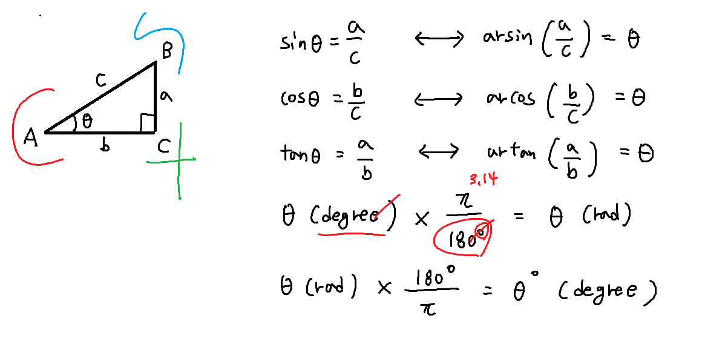
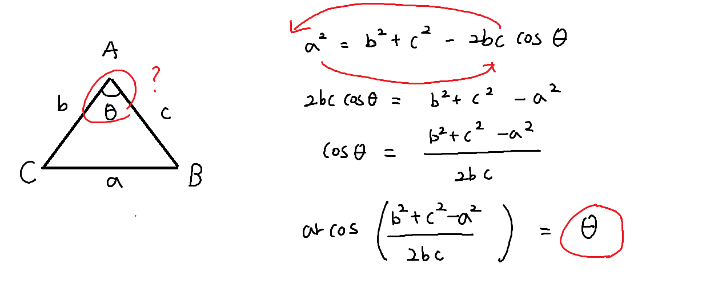

``` python
import math

# 1. rad을 degree로 degree를 rad으로 바꾸는 법
print(math.pi) # 라디안 pi
degree = 30
# rad = 30 * (math.pi / 180) # 라디안으로 바꿀수 있음
rad = math.radians(degree) # 30도 각도를 라디안으로 바꿈
degree = math.degrees(rad) # 다시 degree로 변환

# 2. sin, cos, tan
print(f'{math.sin(rad):.1f}') # sin 30도
print(f'{math.cos(rad):.1f}') # cos 30도
print(f'{math.tan(rad):.1f}') # tan 30도

# 3. 피타고라스 정리 (두 변의 길이를 알았을때 나머지 한변의 길이를 구하기)
# a = ??
b = 4
c = 5
# 식 a**2 + b**2 = c**2
# a**2 = c**2 - b**2
a = math.sqrt(c**2 - b**2)
print(a)

# 4. 삼각함수의 역함수(변의길이를 알고 각도를 알고싶을때)
print(math.asin(a/c))
print(math.acos(b/c))
print(math.atan(a/b))
```


